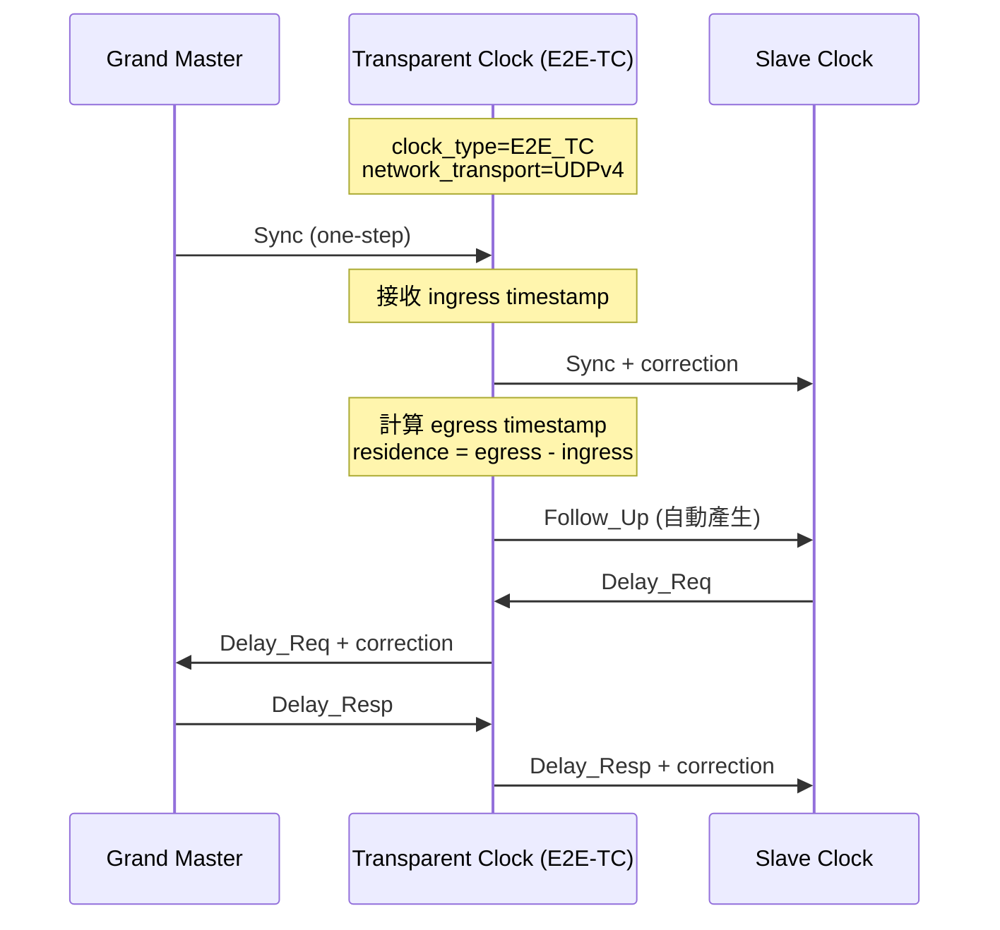

# E2E-TC (End-to-End Transparent Clock) 配置指南

本文件說明如何在 linuxptp 專案中啟用 E2E-TC 透明時鐘，配置 **one-step** 模式和 **UDPv4** 網路傳輸。

---

## 配置概述

### 必要設定參數

| 參數 | 值 | 說明 |
|------|-----|------|
| `clock_type` | `E2E_TC` | 啟用 End-to-End Transparent Clock 模式 |
| `network_transport` | `UDPv4` | 使用 UDP over IPv4 傳輸 |
| `twoStepFlag` | `0` | 啟用 one-step 模式 |
| `time_stamping` | `onestep` | 配合 one-step 操作 (可選) |

---

## 配置檔案範例

### E2E-TC + One-Step + UDPv4 配置

```ini
#
# E2E-TC with One-Step mode over UDPv4
#
[global]
priority1               254
free_running            1
freq_est_interval       3
tc_spanning_tree        1
summary_interval        1
clock_type              E2E_TC
network_transport       UDPv4
twoStepFlag             0
time_stamping           onestep

# 可選：調整延遲相關參數
delay_mechanism         E2E
logMinDelayReqInterval  0

[eth0]
# 指定網路介面
```

### 與預設配置的對比

| 參數 | 預設值 ([default.cfg](file:///d:/prg/arterychip/Davicom/ptp/linuxptp/configs/default.cfg#L120-L123)) | E2E-TC + UDPv4 |
|------|--------|----------------|
| `clock_type` | `OC` (Ordinary Clock) | `E2E_TC` |
| `network_transport` | `UDPv4` | `UDPv4` |
| `twoStepFlag` | `1` | `0` (one-step) |
| `time_stamping` | `hardware` | `onestep` |

---

## 啟動命令

```bash
# 使用配置檔案啟動 ptp4l
sudo ptp4l -f e2e_tc_udp4.cfg -i eth0

# 或使用命令列參數
sudo ptp4l -i eth0 -E --step_threshold=0 \
    --clock_type=E2E_TC \
    --network_transport=UDPv4 \
    --twoStepFlag=0
```

---

## 核心代碼架構

### 相關源代碼檔案

```
linuxptp/
├── e2e_tc.c          # E2E-TC 事件處理與狀態機
├── tc.c              # Transparent Clock 核心轉發邏輯
├── tc.h              # TC 資料結構與函式宣告
├── config.c          # 配置解析與列舉定義
├── transport.h       # 傳輸層類型定義
└── msg.h             # 訊息處理與 one-step 偵測
```

---

## 配置項目詳解

### 1. clock_type 列舉

**檔案**: [config.c:168-174](file:///d:/prg/arterychip/Davicom/ptp/linuxptp/config.c#L168-L174)

```c
static struct config_enum clock_type_enu[] = {
    { "OC",      CLOCK_TYPE_ORDINARY },  // Ordinary Clock
    { "BC",      CLOCK_TYPE_BOUNDARY },  // Boundary Clock
    { "P2P_TC",  CLOCK_TYPE_P2P      },  // Peer-to-Peer TC
    { "E2E_TC",  CLOCK_TYPE_E2E      },  // End-to-End TC ✓
    { NULL, 0 },
};
```

### 2. network_transport 列舉

**檔案**: [config.c:218-223](file:///d:/prg/arterychip/Davicom/ptp/linuxptp/config.c#L218-L223)

```c
static struct config_enum nw_trans_enu[] = {
    { "L2",    TRANS_IEEE_802_3 },  // Layer 2 (Ethernet)
    { "UDPv4", TRANS_UDP_IPV4   },  // UDP over IPv4 ✓
    { "UDPv6", TRANS_UDP_IPV6   },  // UDP over IPv6
    { NULL, 0 },
};
```

**transport_type 定義**: [transport.h:33-42](file:///d:/prg/arterychip/Davicom/ptp/linuxptp/transport.h#L33-L42)

```c
enum transport_type {
    TRANS_UDS = 0,           // Unix Domain Socket
    TRANS_UDP_IPV4 = 1,      // UDP over IPv4 ✓
    TRANS_UDP_IPV6,          // UDP over IPv6
    TRANS_IEEE_802_3,        // Layer 2 Ethernet
    TRANS_DEVICENET,
    TRANS_CONTROLNET,
    TRANS_PROFINET,
};
```

### 3. time_stamping 列舉

**檔案**: [config.c:225-232](file:///d:/prg/arterychip/Davicom/ptp/linuxptp/config.c#L225-L232)

```c
static struct config_enum timestamping_enu[] = {
    { "hardware", TS_HARDWARE  },  // 硬體時間戳
    { "software", TS_SOFTWARE  },  // 軟體時間戳
    { "legacy",   TS_LEGACY_HW },  // 舊式硬體
    { "onestep",  TS_ONESTEP   },  // One-step ✓
    { "p2p1step", TS_P2P1STEP  },  // P2P one-step
    { NULL, 0 },
};
```

---

## E2E-TC 核心邏輯

### 事件處理流程

**檔案**: [e2e_tc.c:81-250](file:///d:/prg/arterychip/Davicom/ptp/linuxptp/e2e_tc.c#L81-L250)

```c
enum fsm_event e2e_event(struct port *p, int fd_index)
{
    // 訊息處理邏輯
    switch (msg_type(msg)) {
    case SYNC:
        tc_fwd_sync(p, msg);      // 轉發 Sync
        process_sync(p, dup);
        break;
    case DELAY_REQ:
        tc_fwd_request(p, msg);   // 轉發 Delay_Req
        break;
    case FOLLOW_UP:
        tc_fwd_folup(p, msg);     // 轉發 Follow_Up
        process_follow_up(p, dup);
        break;
    case DELAY_RESP:
        tc_fwd_response(p, msg);  // 轉發 Delay_Resp
        process_delay_resp(p, dup);
        break;
    case ANNOUNCE:
        tc_forward(p, msg);       // 轉發 Announce
        break;
    }
}
```

### One-Step Sync 處理

**檔案**: [tc.c:446-478](file:///d:/prg/arterychip/Davicom/ptp/linuxptp/tc.c#L446-L478)

當收到 one-step Sync 訊息時，TC 會自動產生 Follow_Up：

```c
int tc_fwd_sync(struct port *q, struct ptp_message *msg)
{
    struct ptp_message *fup = NULL;

    if (one_step(msg)) {
        // 為 one-step Sync 建立 Follow_Up
        fup = msg_allocate();
        fup->header.tsmt = FOLLOW_UP | msg_transport_specific(msg);
        fup->header.ver = msg->header.ver;
        fup->header.messageLength = htons(sizeof(struct follow_up_msg));
        fup->header.domainNumber = msg->header.domainNumber;
        fup->header.sourcePortIdentity = msg->header.sourcePortIdentity;
        fup->header.sequenceId = msg->header.sequenceId;
        fup->follow_up.preciseOriginTimestamp = msg->sync.originTimestamp;

        // 將原始訊息標記為 two-step
        msg->header.flagField[0] |= TWO_STEP;
    }

    err = tc_fwd_event(q, msg);
    if (fup) {
        tc_fwd_folup(q, fup);
        msg_put(fup);
    }
    return err;
}
```

### one_step() 函式

**檔案**: [msg.h:473-478](file:///d:/prg/arterychip/Davicom/ptp/linuxptp/msg.h#L473-L478)

```c
static inline Boolean one_step(struct ptp_message *m)
{
    if (assume_two_step)
        return 0;
    return !field_is_set(m, 0, TWO_STEP);  // 檢查 TWO_STEP flag
}
```

### Residence Time 修正

**檔案**: [tc.c:268-313](file:///d:/prg/arterychip/Davicom/ptp/linuxptp/tc.c#L268-L313)

TC 計算訊息在裝置中的停留時間並更新 correction 欄位：

```c
static int tc_fwd_event(struct port *q, struct ptp_message *msg)
{
    tmv_t egress, ingress = msg->hwts.ts, residence;

    // 發送事件訊息
    for (p = clock_first_port(q->clock); p; p = LIST_NEXT(p, list)) {
        transport_send(p->trp, &p->fda, TRANS_DEFER_EVENT, msg);
    }

    // 獲取傳送時間戳並計算 residence time
    for (p = clock_first_port(q->clock); p; p = LIST_NEXT(p, list)) {
        transport_txts(&p->fda, msg);
        egress = msg->hwts.ts;
        residence = tmv_sub(egress, ingress);  // 計算停留時間

        // 應用頻率補償
        rr = clock_rate_ratio(q->clock);
        if (rr != 1.0) {
            residence = dbl_tmv(tmv_dbl(residence) * rr);
        }

        tc_complete(q, p, msg, residence);  // 完成轉發
    }
}
```

---

## 訊息流程圖



---

## 注意事項

> [!IMPORTANT]
> - **硬體支援**: one-step 模式需要網卡支援硬體時間戳
> - **驅動需求**: 確保網卡驅動支援 `SO_TIMESTAMPING` 和硬體 PTP 時間戳
> - **UDPv4 多播**: 預設使用 `224.0.1.129` (PTP Primary) 和 `224.0.0.107` (P2P)

> [!TIP]
> 使用 `hwstamp_ctl` 工具檢查網卡時間戳能力：
> ```bash
> hwstamp_ctl -i eth0
> ```

---

## 參考資料

- [IEEE 1588-2019](https://standards.ieee.org/standard/1588-2019.html) - PTP 標準
- [linuxptp 官方文件](https://linuxptp.sourceforge.net/)
- [ptp4l(8) man page](file:///d:/prg/arterychip/Davicom/ptp/linuxptp/ptp4l.8)
