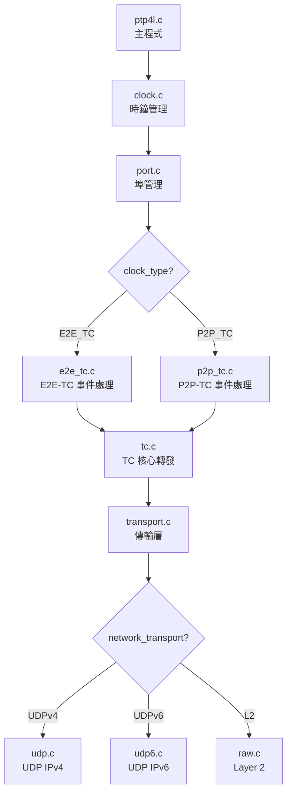
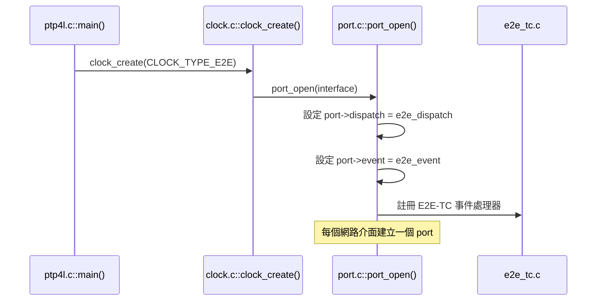
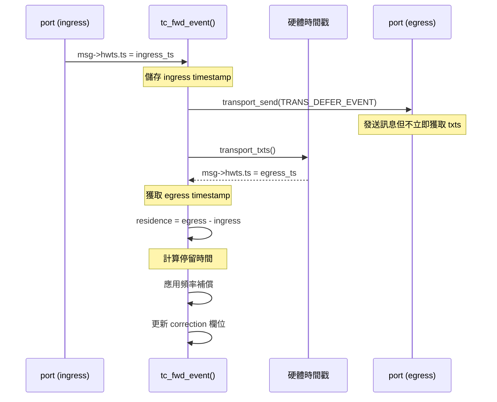

# E2E-TC 透明時鐘實作細節

本文件深入分析 linuxptp 專案中 E2E-TC (End-to-End Transparent Clock) 的實作細節，包含 **one-step** 模式和 **UDPv4** 傳輸的完整代碼流程。

---

## 目錄

1. [快速啟動](#快速啟動)
2. [配置參數深入解析](#配置參數深入解析)
3. [代碼架構與呼叫流程](#代碼架構與呼叫流程)
4. [One-Step 實作機制](#one-step-實作機制)
5. [UDPv4 傳輸層實作](#udpv4-傳輸層實作)
6. [Residence Time 計算](#residence-time-計算)
7. [除錯與驗證](#除錯與驗證)

---

## 快速啟動

### 步驟 1: 建立配置檔案

建立 `e2e_tc_onestep_udp4.cfg`:

```ini
[global]
#
# E2E Transparent Clock with One-Step over UDPv4
#
clock_type              E2E_TC
network_transport       UDPv4
twoStepFlag             0
time_stamping           onestep

# TC 特定設定
priority1               254
free_running            1
freq_est_interval       3
tc_spanning_tree        1

# 延遲機制
delay_mechanism         E2E
logMinDelayReqInterval  0

# 日誌設定
logging_level           6
summary_interval        1
verbose                 0

# UDPv4 多播位址
ptp_dst_ipv4            224.0.1.129
udp_ttl                 1

[eth0]
# 第一個網路介面

[eth1]
# 第二個網路介面 (TC 至少需要兩個埠)
```

### 步驟 2: 檢查硬體支援

```bash
# 檢查網卡是否支援硬體時間戳
ethtool -T eth0

# 應該看到類似輸出:
# Capabilities:
#   hardware-transmit     (SOF_TIMESTAMPING_TX_HARDWARE)
#   hardware-receive      (SOF_TIMESTAMPING_RX_HARDWARE)
#   hardware-raw-clock    (SOF_TIMESTAMPING_RAW_HARDWARE)

# 使用 hwstamp_ctl 啟用時間戳
sudo hwstamp_ctl -i eth0 -r 1 -t 1
sudo hwstamp_ctl -i eth1 -r 1 -t 1
```

### 步驟 3: 啟動 E2E-TC

```bash
# 使用配置檔案啟動
sudo ptp4l -f e2e_tc_onestep_udp4.cfg -m

# 或使用命令列參數
sudo ptp4l -i eth0 -i eth1 \
    --clock_type=E2E_TC \
    --network_transport=UDPv4 \
    --twoStepFlag=0 \
    --time_stamping=onestep \
    --free_running=1 \
    --priority1=254 \
    -m
```

---

## 配置參數深入解析

### clock_type 參數

**定義位置**: [config.c:168-174](file:///d:/prg/arterychip/Davicom/ptp/linuxptp/config.c#L168-L174)

```c
static struct config_enum clock_type_enu[] = {
    { "OC",      CLOCK_TYPE_ORDINARY },  // 0: Ordinary Clock
    { "BC",      CLOCK_TYPE_BOUNDARY },  // 1: Boundary Clock
    { "P2P_TC",  CLOCK_TYPE_P2P      },  // 2: P2P Transparent Clock
    { "E2E_TC",  CLOCK_TYPE_E2E      },  // 3: E2E Transparent Clock
    { NULL, 0 },
};
```

**enum 定義**: [clock.h:38-43](file:///d:/prg/arterychip/Davicom/ptp/linuxptp/clock.h#L38-L43)

```c
enum clock_type {
    CLOCK_TYPE_ORDINARY,
    CLOCK_TYPE_BOUNDARY,
    CLOCK_TYPE_P2P,
    CLOCK_TYPE_E2E,
};
```

**使用位置**: [ptp4l.c:214](file:///d:/prg/arterychip/Davicom/ptp/linuxptp/ptp4l.c#L214)

```c
type = config_get_int(cfg, NULL, "clock_type");
c = clock_create(type, cfg, phc_device);
```

### twoStepFlag 與 one-step 關係

**配置項**: [config.c:386](file:///d:/prg/arterychip/Davicom/ptp/linuxptp/config.c#L386)

```c
GLOB_ITEM_INT("twoStepFlag", 1, 0, 1),  // 預設為 1 (two-step)
```

**驗證邏輯**: [config.c:1101-1127](file:///d:/prg/arterychip/Davicom/ptp/linuxptp/config.c#L1101-L1127)

```c
int two_step_flag = config_get_int(cfg, NULL, "twoStepFlag");

if (timestamping == TS_ONESTEP || timestamping == TS_P2P1STEP) {
    if (two_step_flag) {
        pr_err("one step mode requires twoStepFlag=0");
        return -1;
    }
} else if (two_step_flag == 0) {
    // 自動調整
    pr_debug("one step mode implies twoStepFlag=0, "
             "clearing twoStepFlag to match");
    config_set_int(cfg, "twoStepFlag", 0);
}
```

### network_transport 參數

**配置項**: [config.c:321](file:///d:/prg/arterychip/Davicom/ptp/linuxptp/config.c#L321)

```c
PORT_ITEM_ENU("network_transport", TRANS_UDP_IPV4, nw_trans_enu),
```

**傳輸層建立**: [port.c:3555-3600](file:///d:/prg/arterychip/Davicom/ptp/linuxptp/port.c#L3555)

```c
enum transport_type type = clock_type(clock);
// ...
switch (type) {
case TRANS_UDP_IPV4:
    trp = transport_create(cfg, TRANS_UDP_IPV4);
    break;
case TRANS_UDP_IPV6:
    trp = transport_create(cfg, TRANS_UDP_IPV6);
    break;
case TRANS_IEEE_802_3:
    trp = transport_create(cfg, TRANS_IEEE_802_3);
    break;
}
```

---

## 代碼架構與呼叫流程

### 主要模組關係



### E2E-TC 初始化流程



### 訊息處理流程

**主迴圈**: [clock.c](file:///d:/prg/arterychip/Davicom/ptp/linuxptp/clock.c)

```c
int clock_poll(struct clock *c)
{
    LIST_FOREACH(p, &c->ports, list) {
        // 等待事件
        poll(p->fda.fd, p->fda.cnt, timeout);

        // 處理事件
        event = port_event(p, fd_index);  // 呼叫 e2e_event()

        if (EV_STATE_DECISION_EVENT == event) {
            c->sde++;
        }
        port_dispatch(p, event, 0);  // 呼叫 e2e_dispatch()
    }
}
```

---

## One-Step 實作機制

### one_step() 函式

**檔案**: [msg.h:473-478](file:///d:/prg/arterychip/Davicom/ptp/linuxptp/msg.h#L473-L478)

```c
/**
 * Test whether a message is one-step message.
 * @param m  Message to test.
 * @return   One if the message is a one-step, zero otherwise.
 */
static inline Boolean one_step(struct ptp_message *m)
{
    if (assume_two_step)
        return 0;
    return !field_is_set(m, 0, TWO_STEP);  // 檢查 TWO_STEP bit
}
```

**TWO_STEP flag 定義**: [msg.h:58](file:///d:/prg/arterychip/Davicom/ptp/linuxptp/msg.h#L58)

```c
/* Bits for flagField[0] */
#define ALT_MASTER     (1<<0)
#define TWO_STEP       (1<<1)  // bit 1
#define UNICAST        (1<<2)
```

### One-Step Sync 轉發邏輯

**檔案**: [tc.c:446-478](file:///d:/prg/arterychip/Davicom/ptp/linuxptp/tc.c#L446-L478)

```c
int tc_fwd_sync(struct port *q, struct ptp_message *msg)
{
    struct ptp_message *fup = NULL;
    int err;

    if (one_step(msg)) {
        // 步驟 1: 為 one-step Sync 建立 Follow_Up
        fup = msg_allocate();
        if (!fup) {
            return -1;
        }

        // 步驟 2: 設定 Follow_Up 標頭
        fup->header.tsmt = FOLLOW_UP | msg_transport_specific(msg);
        fup->header.ver = msg->header.ver;
        fup->header.messageLength = htons(sizeof(struct follow_up_msg));
        fup->header.domainNumber = msg->header.domainNumber;
        fup->header.sourcePortIdentity = msg->header.sourcePortIdentity;
        fup->header.sequenceId = msg->header.sequenceId;
        fup->header.logMessageInterval = msg->header.logMessageInterval;

        // 步驟 3: 複製 originTimestamp
        fup->follow_up.preciseOriginTimestamp = msg->sync.originTimestamp;

        // 步驟 4: 添加認證 TLV (如果啟用)
        sad_append_auth_tlv(clock_config(q->clock), q->spp,
                            q->active_key_id, fup);

        // 步驟 5: 將原始 Sync 標記為 two-step
        msg->header.flagField[0] |= TWO_STEP;
        sad_update_auth_tlv(clock_config(q->clock), msg);
    }

    // 步驟 6: 轉發 Sync (event message)
    err = tc_fwd_event(q, msg);
    if (err) {
        return err;
    }

    // 步驟 7: 轉發 Follow_Up (general message)
    if (fup) {
        err = tc_fwd_folup(q, fup);
        msg_put(fup);
    }
    return err;
}
```

### Follow_Up 轉發

**檔案**: [tc.c:411-424](file:///d:/prg/arterychip/Davicom/ptp/linuxptp/tc.c#L411-L424)

```c
int tc_fwd_folup(struct port *q, struct ptp_message *msg)
{
    struct port *p;

    clock_gettime(CLOCK_MONOTONIC, &msg->ts.host);

    // 轉發到所有非阻塞埠
    for (p = clock_first_port(q->clock); p; p = LIST_NEXT(p, list)) {
        if (tc_blocked(q, p, msg)) {
            continue;
        }
        // 完成 Sync/Follow_Up 配對並更新 correction
        tc_complete(q, p, msg, tmv_zero());
    }
    return 0;
}
```

---

## UDPv4 傳輸層實作

### UDP 傳輸初始化

**檔案**: [udp.c](file:///d:/prg/arterychip/Davicom/ptp/linuxptp/udp.c)

```c
static int udp_open(struct transport *t, struct interface *iface,
                    struct fdarray *fda, enum timestamp_type tt)
{
    struct udp *udp = container_of(t, struct udp, t);
    const char *name = interface_name(iface);
    uint8_t event_dscp, general_dscp;
    int efd, gfd, ttl;

    // 建立 event socket (Sync, Delay_Req)
    efd = open_socket_ipv4(name, event_addr, EVENT_PORT, &udp->ip, tt);
    if (efd < 0)
        goto no_event;

    // 建立 general socket (Follow_Up, Delay_Resp, Announce)
    gfd = open_socket_ipv4(name, general_addr, GENERAL_PORT, &udp->ip, tt);
    if (gfd < 0)
        goto no_general;

    // 設定 TTL
    ttl = config_get_int(cfg, iface->name, "udp_ttl");
    if (setsockopt(efd, IPPROTO_IP, IP_MULTICAST_TTL, &ttl, sizeof(ttl)))
        pr_warning("setsockopt IP_MULTICAST_TTL failed");

    // 設定 DSCP
    event_dscp = config_get_int(cfg, NULL, "dscp_event");
    general_dscp = config_get_int(cfg, NULL, "dscp_general");

    fda->fd[FD_EVENT] = efd;
    fda->fd[FD_GENERAL] = gfd;
    return 0;
}
```

### UDPv4 多播位址

**預設值**: [config.c:348](file:///d:/prg/arterychip/Davicom/ptp/linuxptp/config.c#L348)

```c
PORT_ITEM_STR("ptp_dst_ipv4", "224.0.1.129"),  // PTP Primary
PORT_ITEM_STR("p2p_dst_ipv4", "224.0.0.107"),  // PTP P2P
```

**埠號定義**: [udp.h](file:///d:/prg/arterychip/Davicom/ptp/linuxptp/udp.h)

```c
#define EVENT_PORT    319
#define GENERAL_PORT  320
```

### 訊息發送

**檔案**: [udp.c](file:///d:/prg/arterychip/Davicom/ptp/linuxptp/udp.c)

```c
static int udp_send(struct transport *t, struct fdarray *fda,
                    enum transport_event event, struct ptp_message *msg)
{
    struct udp *udp = container_of(t, struct udp, t);
    ssize_t cnt;
    int fd;

    switch (event) {
    case TRANS_GENERAL:
        fd = fda->fd[FD_GENERAL];
        break;
    case TRANS_EVENT:
    case TRANS_ONESTEP:
    case TRANS_DEFER_EVENT:
        fd = fda->fd[FD_EVENT];
        break;
    default:
        return -1;
    }

    // 發送到多播位址
    cnt = sendto(fd, msg, msg_len, 0,
                 (struct sockaddr *)&udp->addr, sizeof(udp->addr));
    return cnt;
}
```

---

## Residence Time 計算

### 時間戳獲取流程



### tc_fwd_event() 詳細流程

**檔案**: [tc.c:268-313](file:///d:/prg/arterychip/Davicom/ptp/linuxptp/tc.c#L268-L313)

```c
static int tc_fwd_event(struct port *q, struct ptp_message *msg)
{
    tmv_t egress, ingress = msg->hwts.ts, residence;
    struct port *p;
    int cnt, err;
    double rr;

    // 記錄接收時間 (用於判斷訊息是否過期)
    clock_gettime(CLOCK_MONOTONIC, &msg->ts.host);

    /* ===== 階段 1: 發送事件訊息 ===== */
    for (p = clock_first_port(q->clock); p; p = LIST_NEXT(p, list)) {
        if (tc_blocked(q, p, msg)) {
            continue;  // 跳過被阻塞的埠
        }

        // 使用 TRANS_DEFER_EVENT 延遲獲取時間戳
        cnt = transport_send(p->trp, &p->fda, TRANS_DEFER_EVENT, msg);
        if (cnt <= 0) {
            pr_err("failed to forward event from %s to %s",
                   q->log_name, p->log_name);
            port_dispatch(p, EV_FAULT_DETECTED, 0);
        }
    }

    /* ===== 階段 2: 獲取傳送時間戳並計算 residence time ===== */
    for (p = clock_first_port(q->clock); p; p = LIST_NEXT(p, list)) {
        if (tc_blocked(q, p, msg)) {
            continue;
        }

        // 獲取硬體傳送時間戳
        err = transport_txts(&p->fda, msg);
        if (err || !msg_sots_valid(msg)) {
            pr_err("failed to fetch txts on %s to %s event",
                   q->log_name, p->log_name);
            port_dispatch(p, EV_FAULT_DETECTED, 0);
            continue;
        }

        // 應用傳送時間戳偏移補償
        ts_add(&msg->hwts.ts, p->tx_timestamp_offset);
        egress = msg->hwts.ts;

        // 計算 residence time
        residence = tmv_sub(egress, ingress);

        // 應用頻率比率補償 (如果時鐘頻率不是 1.0)
        rr = clock_rate_ratio(q->clock);
        if (rr != 1.0) {
            residence = dbl_tmv(tmv_dbl(residence) * rr);
        }

        // 完成轉發並更新 correction 欄位
        tc_complete(q, p, msg, residence);
    }

    return 0;
}
```

### Correction 欄位更新

**檔案**: [tc.c:179-239](file:///d:/prg/arterychip/Davicom/ptp/linuxptp/tc.c#L179-L239)

```c
static void tc_complete_syfup(struct port *q, struct port *p,
                               struct ptp_message *msg, tmv_t residence)
{
    enum tc_match type = TC_MISMATCH;
    struct ptp_message *fup;
    struct tc_txd *txd;
    Integer64 c1, c2;
    int cnt;

    // 尋找配對的 Sync/Follow_Up
    TAILQ_FOREACH(txd, &p->tc_transmitted, list) {
        type = tc_match_syfup(portnum(q), msg, txd);
        switch (type) {
        case TC_SYNC_FUP:
            fup = msg;
            residence = txd->residence;
            break;
        case TC_FUP_SYNC:
            fup = txd->msg;
            break;
        }
        if (type != TC_MISMATCH) {
            break;
        }
    }

    if (type == TC_MISMATCH) {
        // 尚未收到配對訊息，暫存
        txd = tc_allocate();
        msg_get(msg);
        txd->msg = msg;
        txd->residence = residence;
        txd->ingress_port = portnum(q);
        TAILQ_INSERT_TAIL(&p->tc_transmitted, txd, list);
        return;
    }

    // 更新 correction 欄位
    c1 = net2host64(fup->header.correction);
    c2 = c1 + tmv_to_TimeInterval(residence);  // 加上 residence time
    c2 += tmv_to_TimeInterval(q->peer_delay);  // 加上 peer delay (如果有)
    c2 += q->asymmetry;                        // 加上非對稱補償
    fup->header.correction = host2net64(c2);

    // 更新認證 TLV
    sad_update_auth_tlv(clock_config(q->clock), fup);

    // 發送 Follow_Up
    cnt = transport_send(p->trp, &p->fda, TRANS_GENERAL, fup);
    if (cnt <= 0) {
        pr_err("tc failed to forward follow up on %s", p->log_name);
        port_dispatch(p, EV_FAULT_DETECTED, 0);
    }

    // 恢復原始 correction 值 (供下一個 egress port 使用)
    fup->header.correction = host2net64(c1);

    // 清理配對記錄
    TAILQ_REMOVE(&p->tc_transmitted, txd, list);
    msg_put(txd->msg);
    tc_recycle(txd);
}
```

### TimeInterval 格式

**PTP 標準定義**: correction 欄位使用 **scaled nanoseconds** (2^-16 秒)

```c
// tmv.h
static inline Integer64 tmv_to_TimeInterval(tmv_t x)
{
    return tmv_to_nanoseconds(x) << 16;  // 轉換為 scaled ns
}
```

**範例計算**:
- Residence time = 1000 ns
- TimeInterval = 1000 × 2^16 = 65,536,000
- Correction field += 65,536,000

---

## 除錯與驗證

### 啟用詳細日誌

```bash
# 使用 -m 參數輸出到 stdout
sudo ptp4l -f e2e_tc_onestep_udp4.cfg -m -l 7

# 或設定 logging_level
[global]
logging_level    7  # 0=EMERG, 7=DEBUG
verbose          1
```

### 關鍵日誌訊息

**E2E-TC 初始化**:
```
ptp4l[xxx]: selected /dev/ptp0 as PTP clock
ptp4l[xxx]: port 1: INITIALIZING to LISTENING on INIT_COMPLETE
ptp4l[xxx]: port 2: INITIALIZING to LISTENING on INIT_COMPLETE
```

**One-Step 訊息處理**:
```
ptp4l[xxx]: port 1: received SYNC (one-step)
ptp4l[xxx]: tc: forwarding SYNC with residence 1234 ns
ptp4l[xxx]: tc: generated FOLLOW_UP for one-step SYNC
```

**Correction 欄位更新**:
```
ptp4l[xxx]: tc: SYNC correction before: 0
ptp4l[xxx]: tc: residence time: 1234 ns
ptp4l[xxx]: tc: SYNC correction after: 80871424 (scaled ns)
```

### 使用 tcpdump 驗證

```bash
# 捕獲 PTP 訊息
sudo tcpdump -i eth0 -vv -X 'udp port 319 or udp port 320'

# 過濾 Sync 訊息
sudo tcpdump -i eth0 -vv 'udp port 319 and udp[0:1] = 0x00'

# 過濾 Follow_Up 訊息
sudo tcpdump -i eth0 -vv 'udp port 320 and udp[0:1] = 0x08'
```

### PTP 訊息格式驗證

**Sync 訊息 (one-step → two-step 轉換)**:

```
Before TC:
  flagField[0] = 0x00  (one-step, TWO_STEP bit = 0)

After TC:
  flagField[0] = 0x02  (two-step, TWO_STEP bit = 1)
  correction   = original + residence_time
```

**Follow_Up 訊息**:

```
messageType           = 0x08 (FOLLOW_UP)
sequenceId            = (same as Sync)
sourcePortIdentity    = (same as Sync)
preciseOriginTimestamp = (from original Sync)
correction            = (updated with residence time)
```

### 使用 pmc 監控

```bash
# 查詢 TC 狀態
pmc -u -b 0 'GET CURRENT_DATA_SET'
pmc -u -b 0 'GET PORT_DATA_SET'
pmc -u -b 0 'GET TIME_PROPERTIES_DATA_SET'

# 查詢 correction 統計
pmc -u -b 0 'GET TRANSPARENT_CLOCK_DEFAULT_DATA_SET'
```

---

## 常見問題排查

### 問題 1: 硬體時間戳不可用

**症狀**:
```
ptp4l[xxx]: failed to fetch txts on eth0
ptp4l[xxx]: timed out while polling for tx timestamp
```

**解決方案**:
```bash
# 檢查驅動支援
ethtool -T eth0

# 確認 PHC 裝置
ls -l /dev/ptp*

# 重新啟用硬體時間戳
sudo hwstamp_ctl -i eth0 -r 1 -t 1
```

### 問題 2: One-Step 與 Two-Step 衝突

**症狀**:
```
ptp4l[xxx]: one step mode requires twoStepFlag=0
```

**解決方案**:
```ini
[global]
twoStepFlag       0      # 必須設為 0
time_stamping     onestep
```

### 問題 3: UDPv4 多播路由問題

**症狀**:
```
ptp4l[xxx]: sendto failed: Network is unreachable
```

**解決方案**:
```bash
# 添加多播路由
sudo route add -net 224.0.0.0 netmask 240.0.0.0 dev eth0

# 檢查多播路由
ip route show | grep 224
```

### 問題 4: TC 埠狀態異常

**症狀**:
```
ptp4l[xxx]: port 1: FAULTY
```

**解決方案**:
```bash
# 檢查網路連線
ethtool eth0 | grep "Link detected"

# 檢查 spanning tree 設定
[global]
tc_spanning_tree  1  # 啟用生成樹協定
```

---

## 效能調校

### 減少延遲

```ini
[global]
# 減少 Sync 間隔 (更頻繁同步)
logSyncInterval         -1  # 500ms

# 減少 Delay_Req 間隔
logMinDelayReqInterval  -1  # 500ms

# 增加 CPU 優先級
socket_priority         6
```

### 提高精度

```ini
[global]
# 使用硬體時間戳
time_stamping           onestep

# 啟用頻率估計
freq_est_interval       1

# 設定時間戳偏移補償
[eth0]
egressLatency           100   # ns
ingressLatency          100   # ns
```

---

## 參考資料

### 相關檔案

| 檔案 | 功能 |
|------|------|
| [e2e_tc.c](file:///d:/prg/arterychip/Davicom/ptp/linuxptp/e2e_tc.c) | E2E-TC 事件處理 |
| [tc.c](file:///d:/prg/arterychip/Davicom/ptp/linuxptp/tc.c) | TC 核心轉發邏輯 |
| [tc.h](file:///d:/prg/arterychip/Davicom/ptp/linuxptp/tc.h) | TC 資料結構 |
| [udp.c](file:///d:/prg/arterychip/Davicom/ptp/linuxptp/udp.c) | UDPv4 傳輸實作 |
| [config.c](file:///d:/prg/arterychip/Davicom/ptp/linuxptp/config.c) | 配置解析 |
| [msg.h](file:///d:/prg/arterychip/Davicom/ptp/linuxptp/msg.h) | 訊息處理 |

### 標準文件

- **IEEE 1588-2019**: Precision Time Protocol (PTP) v2.1
- **RFC 1305**: Network Time Protocol (NTP)
- **IEEE 802.1AS**: Timing and Synchronization for Time-Sensitive Applications

### 線上資源

- [linuxptp 官方網站](https://linuxptp.sourceforge.net/)
- [linuxptp GitHub](https://github.com/richardcochran/linuxptp)
- [PTP 協定說明](https://en.wikipedia.org/wiki/Precision_Time_Protocol)
