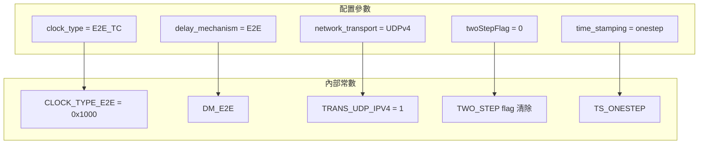
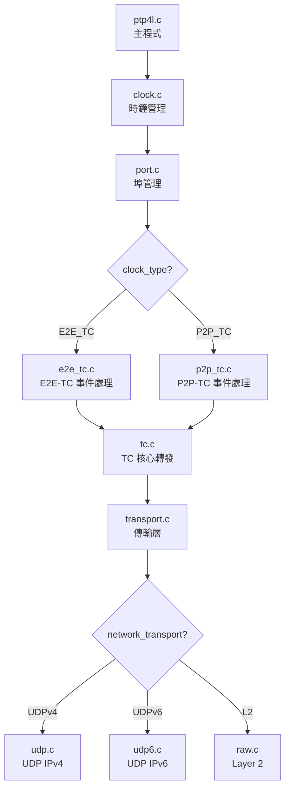
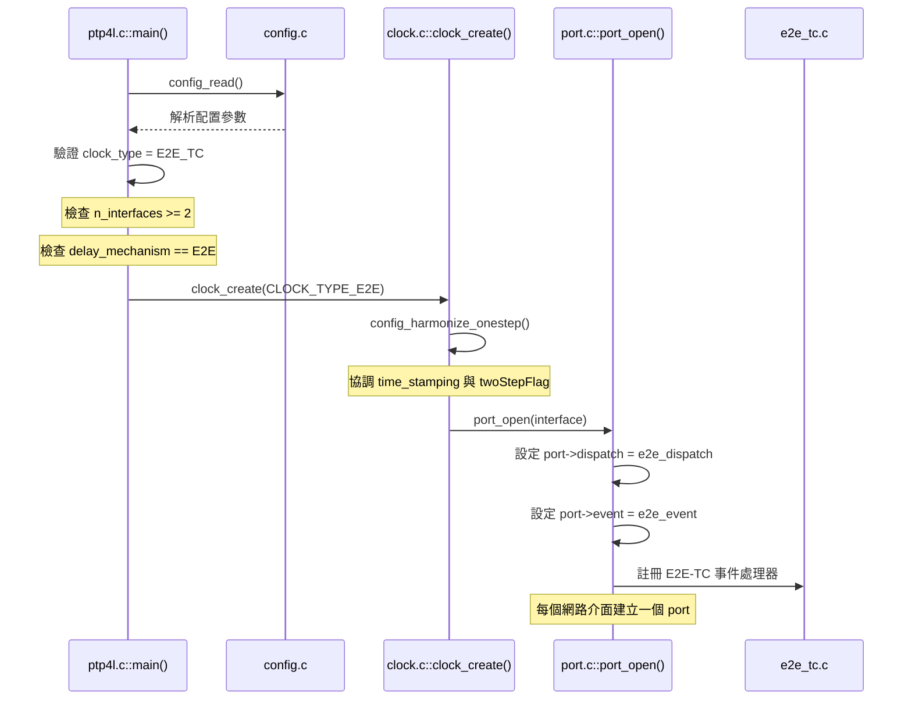
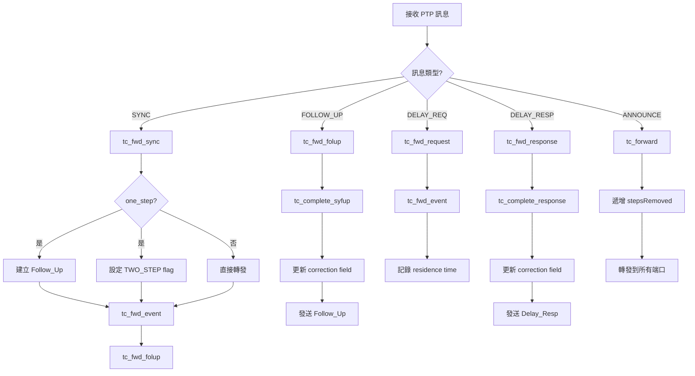
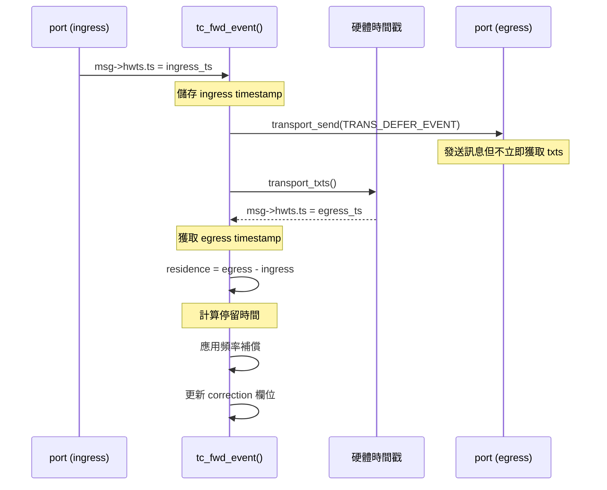

# E2E Transparent Clock (E2E-TC) 完整技術指南

本文件整合 linuxptp 專案中 End-to-End Transparent Clock (E2E-TC) 的所有相關技術資料，涵蓋配置方法、代碼架構、呼叫流程與實作細節。

---

## 目錄

1. [概述](#1-概述)
   - 1.1 [什麼是 E2E Transparent Clock](#11-什麼是-e2e-transparent-clock)
   - 1.2 [配置目標概覽](#12-配置目標概覽)
2. [快速入門](#2-快速入門)
   - 2.1 [最小配置檔案](#21-最小配置檔案)
   - 2.2 [啟動命令](#22-啟動命令)
   - 2.3 [硬體需求檢查](#23-硬體需求檢查)
3. [配置參數詳解](#3-配置參數詳解)
   - 3.1 [clock_type 參數](#31-clock_type-參數)
   - 3.2 [delay_mechanism 參數](#32-delay_mechanism-參數)
   - 3.3 [network_transport 參數](#33-network_transport-參數)
   - 3.4 [time_stamping 與 twoStepFlag 參數](#34-time_stamping-與-twostepflag-參數)
   - 3.5 [TC 特定參數](#35-tc-特定參數)
   - 3.6 [參數對照表](#36-參數對照表)
4. [代碼架構](#4-代碼架構)
   - 4.1 [檔案結構](#41-檔案結構)
   - 4.2 [模組關係圖](#42-模組關係圖)
   - 4.3 [核心資料結構](#43-核心資料結構)
5. [呼叫流程](#5-呼叫流程)
   - 5.1 [E2E-TC 初始化流程](#51-e2e-tc-初始化流程)
   - 5.2 [訊息處理流程](#52-訊息處理流程)
   - 5.3 [Residence Time 計算流程](#53-residence-time-計算流程)
6. [One-Step 模式實作](#6-one-step-模式實作)
   - 6.1 [One-Step 判斷機制](#61-one-step-判斷機制)
   - 6.2 [One-Step Sync 處理](#62-one-step-sync-處理)
   - 6.3 [配置協調函數](#63-配置協調函數)
7. [UDPv4 傳輸層實作](#7-udpv4-傳輸層實作)
   - 7.1 [網路參數定義](#71-網路參數定義)
   - 7.2 [Socket 初始化](#72-socket-初始化)
   - 7.3 [訊息發送機制](#73-訊息發送機制)
8. [Correction Field 更新機制](#8-correction-field-更新機制)
   - 8.1 [更新公式](#81-更新公式)
   - 8.2 [Sync/Follow_Up 配對處理](#82-syncfollow_up-配對處理)
9. [除錯與驗證](#9-除錯與驗證)
   - 9.1 [日誌設定](#91-日誌設定)
   - 9.2 [使用 tcpdump 驗證](#92-使用-tcpdump-驗證)
   - 9.3 [使用 pmc 監控](#93-使用-pmc-監控)
   - 9.4 [Wireshark 封包檢查](#94-wireshark-封包檢查)
10. [常見問題與解決方案](#10-常見問題與解決方案)
11. [效能調校](#11-效能調校)
12. [參考資料](#12-參考資料)

---

## 1. 概述

### 1.1 什麼是 E2E Transparent Clock

E2E Transparent Clock (E2E-TC) 是 IEEE 1588 PTP 協議中的一種時鐘類型，它具有以下特性：

- **不參與主從選舉**: TC 不會成為 Master 或 Slave，僅作為中間轉發設備
- **轉發 PTP 訊息**: 將接收到的 PTP 訊息轉發到所有其他端口
- **計算駐留時間 (Residence Time)**: 測量訊息在設備中的停留時間
- **修正 Correction Field**: 將駐留時間累加到訊息的 correction field 中
- **使用 E2E 延遲機制**: 處理 Delay_Req/Delay_Resp 訊息

```
       Master                   TC (E2E-TC)                  Slave
          |                         |                          |
          |---- Sync (one-step) --->|                          |
          |                         |---- Sync (two-step) ---->|
          |                         |---- Follow_Up ---------->|
          |                         |    (含駐留時間修正)        |
          |                         |                          |
          |                         |<----- Delay_Req ---------|
          |<---- Delay_Req ---------|                          |
          |                         |                          |
          |---- Delay_Resp -------->|                          |
          |                         |---- Delay_Resp --------->|
          |                         |   (修正 correctionField)  |
```

### 1.2 配置目標概覽

本指南說明如何配置以下三個關鍵功能：

| 功能 | 配置值 | 說明 |
|------|--------|------|
| **Clock Type** | `E2E_TC` | End-to-End Transparent Clock |
| **Timestamping** | `onestep` | One-Step 硬體時間戳 |
| **Network Transport** | `UDPv4` | UDP over IPv4 傳輸 |

---

## 2. 快速入門

### 2.1 最小配置檔案

建立 `e2e_tc_onestep_udpv4.cfg`：

```ini
[global]
#
# E2E Transparent Clock with One-Step over UDPv4
#
clock_type              E2E_TC
network_transport       UDPv4
twoStepFlag             0
time_stamping           hardware
delay_mechanism         E2E

# TC 特定設定
tc_spanning_tree        1
free_running            1
priority1               254

# 日誌設定
summary_interval        1
logging_level           6

[eth0]
# 第一個網路介面

[eth1]
# 第二個網路介面 (TC 至少需要兩個埠)
```

### 2.2 啟動命令

**方法 1: 使用配置檔案**

```bash
sudo ptp4l -f e2e_tc_onestep_udpv4.cfg -i eth0 -i eth1 -m
```

**方法 2: 純命令列**

```bash
sudo ptp4l -E -4 -H -i eth0 -i eth1 \
    --clock_type E2E_TC \
    --twoStepFlag 0 \
    --tc_spanning_tree 1 \
    --free_running 1 \
    -m
```

**命令列參數說明**：

| 參數 | 配置參數 | 說明 |
|------|----------|------|
| `-4` | `network_transport UDPv4` | 使用 UDP/IPv4 |
| `-6` | `network_transport UDPv6` | 使用 UDP/IPv6 |
| `-2` | `network_transport L2` | 使用 IEEE 802.3 |
| `-E` | `delay_mechanism E2E` | E2E 延遲機制 |
| `-P` | `delay_mechanism P2P` | P2P 延遲機制 |
| `-H` | `time_stamping hardware` | 硬體時間戳 |
| `-i` | N/A | 指定網路介面 |
| `-f` | N/A | 指定配置檔案 |
| `-m` | `verbose 1` | 輸出到 stdout |

### 2.3 硬體需求檢查

```bash
# 檢查網卡是否支援硬體時間戳
ethtool -T eth0

# 應該看到類似輸出:
# Capabilities:
#   hardware-transmit     (SOF_TIMESTAMPING_TX_HARDWARE)
#   hardware-receive      (SOF_TIMESTAMPING_RX_HARDWARE)
#   hardware-raw-clock    (SOF_TIMESTAMPING_RAW_HARDWARE)

# 使用 hwstamp_ctl 啟用時間戳
sudo hwstamp_ctl -i eth0 -r 1 -t 1
sudo hwstamp_ctl -i eth1 -r 1 -t 1
```

> [!IMPORTANT]
> **E2E-TC 必要條件**：
> - 至少需要 **兩個網路介面**
> - `delay_mechanism` 必須設定為 `E2E`
> - One-step 模式需要網卡支援硬體時間戳

---

## 3. 配置參數詳解

### 3.1 clock_type 參數

**定義位置**: [config.c:152-157](file:///d:/prg/arterychip/Davicom/ptp/linuxptp/config.c#L152-L157)

```c
static struct config_enum clock_type_enu[] = {
    { "OC",      CLOCK_TYPE_ORDINARY },   // 0x8000 - Ordinary Clock
    { "BC",      CLOCK_TYPE_BOUNDARY },   // 0x4000 - Boundary Clock
    { "P2P_TC",  CLOCK_TYPE_P2P      },   // 0x2000 - P2P Transparent Clock
    { "E2E_TC",  CLOCK_TYPE_E2E      },   // 0x1000 - E2E Transparent Clock
    { NULL, 0 },
};
```

**enum 定義**: [clock.h:37-43](file:///d:/prg/arterychip/Davicom/ptp/linuxptp/clock.h#L37-L43)

```c
enum clock_type {
    CLOCK_TYPE_ORDINARY   = 0x8000,
    CLOCK_TYPE_BOUNDARY   = 0x4000,
    CLOCK_TYPE_P2P        = 0x2000,
    CLOCK_TYPE_E2E        = 0x1000,
    CLOCK_TYPE_MANAGEMENT = 0x0800,
};
```

| 配置值 | 枚舉值 | 說明 |
|--------|--------|------|
| `OC` | `CLOCK_TYPE_ORDINARY` | Ordinary Clock (單端口) |
| `BC` | `CLOCK_TYPE_BOUNDARY` | Boundary Clock (多端口) |
| `P2P_TC` | `CLOCK_TYPE_P2P` | P2P Transparent Clock |
| `E2E_TC` | `CLOCK_TYPE_E2E` | E2E Transparent Clock |

### 3.2 delay_mechanism 參數

**定義位置**: [config.c:171-177](file:///d:/prg/arterychip/Davicom/ptp/linuxptp/config.c#L171-L177)

```c
static struct config_enum delay_mech_enu[] = {
    { "Auto", DM_AUTO },          // 自動選擇
    { "E2E",  DM_E2E },           // End-to-End (Delay_Req/Delay_Resp)
    { "P2P",  DM_P2P },           // Peer-to-Peer (Pdelay_Req/Pdelay_Resp)
    { "NONE", DM_NO_MECHANISM },  // 無延遲測量
    { NULL, 0 },
};
```

> [!WARNING]
> `E2E_TC` 必須使用 `E2E` 延遲機制，使用其他值會導致啟動失敗。

### 3.3 network_transport 參數

**定義位置**: [config.c:200-205](file:///d:/prg/arterychip/Davicom/ptp/linuxptp/config.c#L200-L205)

```c
static struct config_enum nw_trans_enu[] = {
    { "L2",    TRANS_IEEE_802_3 },   // IEEE 802.3 (Layer 2)
    { "UDPv4", TRANS_UDP_IPV4   },   // UDP over IPv4
    { "UDPv6", TRANS_UDP_IPV6   },   // UDP over IPv6
    { NULL, 0 },
};
```

**傳輸類型定義**: [transport.h:33-41](file:///d:/prg/arterychip/Davicom/ptp/linuxptp/transport.h#L33-L41)

```c
enum transport_type {
    TRANS_UDS = 0,       // Unix Domain Socket (內部使用)
    TRANS_UDP_IPV4 = 1,  // UDP over IPv4
    TRANS_UDP_IPV6,      // UDP over IPv6
    TRANS_IEEE_802_3,    // IEEE 802.3 (Ethernet)
    TRANS_DEVICENET,
    TRANS_CONTROLNET,
    TRANS_PROFINET,
};
```

### 3.4 time_stamping 與 twoStepFlag 參數

**時間戳類型定義**: [msg.h:76-82](file:///d:/prg/arterychip/Davicom/ptp/linuxptp/msg.h#L76-L82)

```c
enum timestamp_type {
    TS_SOFTWARE,   // 軟體時間戳記
    TS_HARDWARE,   // 硬體時間戳記 (two-step)
    TS_LEGACY_HW,  // 舊版硬體時間戳記
    TS_ONESTEP,    // One-step 硬體時間戳記
    TS_P2P1STEP,   // P2P One-step
};
```

**One-Step vs Two-Step 對照**：

| twoStepFlag | 模式 | 說明 |
|-------------|------|------|
| `0` | One-Step | Sync 訊息直接包含精確時間戳 |
| `1` | Two-Step | 需要 Follow_Up 訊息傳送精確時間戳 |

**配置組合**：

| time_stamping | twoStepFlag | 結果 |
|---------------|-------------|------|
| `hardware` | `0` | 自動升級為 `onestep` |
| `hardware` | `1` | 保持 `hardware` (two-step) |
| `onestep` | `0` | One-step 模式 |
| `onestep` | `1` | 自動修正為 `twoStepFlag=0` |
| `software` | `0` | **錯誤**: 軟體時間戳不支援 one-step |

### 3.5 TC 特定參數

| 參數 | 預設值 | 說明 |
|------|--------|------|
| `tc_spanning_tree` | `0` | 啟用生成樹協議過濾 |
| `free_running` | `0` | TC 不調整本地時鐘 |
| `priority1` | `128` | 建議設為 `254` (不參與 BMCA) |
| `freq_est_interval` | `1` | 頻率估計間隔 |

### 3.6 參數對照表



---

## 4. 代碼架構

### 4.1 檔案結構

```
linuxptp-4.2/
├── ptp4l.c            # 主程式入口，時鐘類型驗證
├── clock.c / clock.h  # 時鐘創建與管理
├── port.c / port.h    # 端口管理和消息處理
├── tc.c / tc.h        # Transparent Clock 核心邏輯
├── e2e_tc.c           # E2E-TC 事件處理
├── p2p_tc.c           # P2P-TC 事件處理
├── config.c / config.h# 配置解析
├── transport.c        # 傳輸層抽象
├── udp.c / udp.h      # UDPv4 傳輸實現
├── udp6.c             # UDPv6 傳輸實現
├── raw.c              # Layer 2 傳輸實現
├── msg.c / msg.h      # PTP 消息處理
└── sk.c               # Socket 和硬體時間戳配置
```

### 4.2 模組關係圖



### 4.3 核心資料結構

**enum clock_type** - [clock.h:37-43](file:///d:/prg/arterychip/Davicom/ptp/linuxptp/clock.h#L37-L43)

```c
enum clock_type {
    CLOCK_TYPE_ORDINARY   = 0x8000,
    CLOCK_TYPE_BOUNDARY   = 0x4000,
    CLOCK_TYPE_P2P        = 0x2000,
    CLOCK_TYPE_E2E        = 0x1000,  // E2E_TC
    CLOCK_TYPE_MANAGEMENT = 0x0800,
};
```

**enum transport_type** - [transport.h:33-41](file:///d:/prg/arterychip/Davicom/ptp/linuxptp/transport.h#L33-L41)

```c
enum transport_type {
    TRANS_UDS = 0,
    TRANS_UDP_IPV4 = 1,  // UDPv4
    TRANS_UDP_IPV6,
    TRANS_IEEE_802_3,
};
```

**enum transport_event** - [transport.h:48](file:///d:/prg/arterychip/Davicom/ptp/linuxptp/transport.h#L48)

```c
enum transport_event {
    TRANS_GENERAL,      // 一般訊息 (Follow_Up, Delay_Resp)
    TRANS_EVENT,        // 事件訊息 (Sync, Delay_Req)
    TRANS_ONESTEP,      // One-Step 訊息
    TRANS_P2P1STEP,     // P2P One-Step 訊息
    TRANS_DEFER_EVENT,  // 延遲的事件訊息 (用於 TC)
};
```

**TC 傳輸數據結構** - [tc.c](file:///d:/prg/arterychip/Davicom/ptp/linuxptp/tc.c)

```c
struct tc_txd {
    struct ptp_message *msg;  // 原始消息
    tmv_t residence;          // residence time
    int ingress_port;         // 入口端口
    TAILQ_ENTRY(tc_txd) list;
};
```

---

## 5. 呼叫流程

### 5.1 E2E-TC 初始化流程



**位置**: [ptp4l.c:220-240](file:///d:/prg/arterychip/Davicom/ptp/linuxptp/ptp4l.c#L220-L240)

```c
type = config_get_int(cfg, NULL, "clock_type");
switch (type) {
    case CLOCK_TYPE_E2E:
        if (cfg->n_interfaces < 2) {
            fprintf(stderr, "TC needs at least two interfaces\n");
            goto out;
        }
        if (DM_E2E != config_get_int(cfg, NULL, "delay_mechanism")) {
            fprintf(stderr, "E2E_TC needs E2E delay mechanism\n");
            goto out;
        }
        break;
}
```

**端口事件處理器綁定** - [port.c:3300-3315](file:///d:/prg/arterychip/Davicom/ptp/linuxptp/port.c#L3300-L3315)

```c
switch (type) {
case CLOCK_TYPE_ORDINARY:
case CLOCK_TYPE_BOUNDARY:
    p->dispatch = bc_dispatch;
    p->event = bc_event;
    break;
case CLOCK_TYPE_P2P:
    p->dispatch = p2p_dispatch;
    p->event = p2p_event;
    break;
case CLOCK_TYPE_E2E:
    p->dispatch = e2e_dispatch;   // E2E-TC 狀態機
    p->event = e2e_event;         // E2E-TC 事件處理
    break;
}
```

### 5.2 訊息處理流程



**E2E-TC 事件處理** - [e2e_tc.c:76-217](file:///d:/prg/arterychip/Davicom/ptp/linuxptp/e2e_tc.c#L76-L217)

```c
enum fsm_event e2e_event(struct port *p, int fd_index)
{
    // ... 接收消息 ...

    switch (msg_type(msg)) {
    case SYNC:
        if (tc_fwd_sync(p, msg)) {
            event = EV_FAULT_DETECTED;
        }
        if (dup) {
            process_sync(p, dup);
        }
        break;

    case DELAY_REQ:
        if (tc_fwd_request(p, msg)) {
            event = EV_FAULT_DETECTED;
        }
        break;

    case FOLLOW_UP:
        if (tc_fwd_folup(p, msg)) {
            event = EV_FAULT_DETECTED;
        }
        if (dup) {
            process_follow_up(p, dup);
        }
        break;

    case DELAY_RESP:
        if (tc_fwd_response(p, msg)) {
            event = EV_FAULT_DETECTED;
        }
        if (dup) {
            process_delay_resp(p, dup);
        }
        break;

    case ANNOUNCE:
        if (tc_forward(p, msg)) {
            event = EV_FAULT_DETECTED;
        }
        if (dup && process_announce(p, dup)) {
            event = EV_STATE_DECISION_EVENT;
        }
        break;
    }
    // ...
}
```

### 5.3 Residence Time 計算流程



**tc_fwd_event 詳細流程** - [tc.c:268-313](file:///d:/prg/arterychip/Davicom/ptp/linuxptp/tc.c#L268-L313)

```c
static int tc_fwd_event(struct port *q, struct ptp_message *msg)
{
    tmv_t egress, ingress = msg->hwts.ts, residence;
    struct port *p;
    int cnt, err;
    double rr;

    clock_gettime(CLOCK_MONOTONIC, &msg->ts.host);

    /* ===== 階段 1: 發送事件訊息 ===== */
    for (p = clock_first_port(q->clock); p; p = LIST_NEXT(p, list)) {
        if (tc_blocked(q, p, msg)) {
            continue;  // 跳過被阻塞的埠
        }
        // 使用 TRANS_DEFER_EVENT 延遲獲取時間戳
        cnt = transport_send(p->trp, &p->fda, TRANS_DEFER_EVENT, msg);
        if (cnt <= 0) {
            pr_err("failed to forward event from %s to %s",
                   q->log_name, p->log_name);
            port_dispatch(p, EV_FAULT_DETECTED, 0);
        }
    }

    /* ===== 階段 2: 獲取傳送時間戳並計算 residence time ===== */
    for (p = clock_first_port(q->clock); p; p = LIST_NEXT(p, list)) {
        if (tc_blocked(q, p, msg)) {
            continue;
        }
        // 獲取硬體傳送時間戳
        err = transport_txts(&p->fda, msg);
        if (err || !msg_sots_valid(msg)) {
            pr_err("failed to fetch txts on %s to %s event",
                   q->log_name, p->log_name);
            port_dispatch(p, EV_FAULT_DETECTED, 0);
            continue;
        }

        // 應用傳送時間戳偏移補償
        ts_add(&msg->hwts.ts, p->tx_timestamp_offset);
        egress = msg->hwts.ts;

        // 計算 residence time
        residence = tmv_sub(egress, ingress);

        // 應用頻率比率補償 (如果時鐘頻率不是 1.0)
        rr = clock_rate_ratio(q->clock);
        if (rr != 1.0) {
            residence = dbl_tmv(tmv_dbl(residence) * rr);
        }

        // 完成轉發並更新 correction 欄位
        tc_complete(q, p, msg, residence);
    }

    return 0;
}
```

---

## 6. One-Step 模式實作

### 6.1 One-Step 判斷機制

**one_step() 函式** - [msg.h:458-463](file:///d:/prg/arterychip/Davicom/ptp/linuxptp/msg.h#L458-L463)

```c
static inline Boolean one_step(struct ptp_message *m)
{
    if (assume_two_step)
        return 0;
    return !field_is_set(m, 0, TWO_STEP);  // 檢查 TWO_STEP bit
}
```

**TWO_STEP flag 定義** - [msg.h:58](file:///d:/prg/arterychip/Davicom/ptp/linuxptp/msg.h#L58)

```c
/* Bits for flagField[0] */
#define ALT_MASTER     (1<<0)
#define TWO_STEP       (1<<1)  // bit 1
#define UNICAST        (1<<2)
```

- **TWO_STEP = 0**: One-step 模式 (Sync 訊息包含精確時間)
- **TWO_STEP = 1**: Two-step 模式 (需要 Follow_Up 訊息)

### 6.2 One-Step Sync 處理

當 TC 收到 one-step Sync 訊息時，會執行以下轉換：

**tc_fwd_sync 函式** - [tc.c:398-433](file:///d:/prg/arterychip/Davicom/ptp/linuxptp/tc.c#L398-L433)

```c
int tc_fwd_sync(struct port *q, struct ptp_message *msg)
{
    struct ptp_message *fup = NULL;
    int err;

    // 步驟 1: 檢查是否為 one-step Sync
    if (one_step(msg)) {
        // 步驟 2: 為 one-step Sync 建立 Follow_Up
        fup = msg_allocate();
        if (!fup) {
            return -1;
        }

        // 步驟 3: 設定 Follow_Up 標頭
        fup->header.tsmt = FOLLOW_UP | msg_transport_specific(msg);
        fup->header.ver = msg->header.ver;
        fup->header.messageLength = htons(sizeof(struct follow_up_msg));
        fup->header.domainNumber = msg->header.domainNumber;
        fup->header.sourcePortIdentity = msg->header.sourcePortIdentity;
        fup->header.sequenceId = msg->header.sequenceId;
        fup->header.logMessageInterval = msg->header.logMessageInterval;

        // 步驟 4: 複製 originTimestamp
        fup->follow_up.preciseOriginTimestamp = msg->sync.originTimestamp;

        // 步驟 5: 添加認證 TLV (如果啟用)
        sad_append_auth_tlv(clock_config(q->clock), q->spp,
                            q->active_key_id, fup);

        // 步驟 6: 將原始 Sync 標記為 two-step
        msg->header.flagField[0] |= TWO_STEP;
        sad_update_auth_tlv(clock_config(q->clock), msg);
    }

    // 步驟 7: 轉發 Sync (event message)
    err = tc_fwd_event(q, msg);
    if (err) {
        return err;
    }

    // 步驟 8: 轉發 Follow_Up (general message)
    if (fup) {
        err = tc_fwd_folup(q, fup);
        msg_put(fup);
    }
    return err;
}
```

**關鍵流程**：

1. **檢測 one-step 模式**：使用 `one_step(msg)` 判斷
2. **創建 Follow_Up**：動態分配並填充 Follow_Up 訊息
3. **設定 TWO_STEP flag**：將原始 Sync 標記為 two-step
4. **轉發 Sync**：調用 `tc_fwd_event()` 處理事件訊息
5. **轉發 Follow_Up**：調用 `tc_fwd_folup()` 處理 Follow_Up

### 6.3 配置協調函數

**config_harmonize_onestep** - [config.c:1045-1081](file:///d:/prg/arterychip/Davicom/ptp/linuxptp/config.c#L1045-L1081)

```c
int config_harmonize_onestep(struct config *cfg)
{
    enum timestamp_type tstype = config_get_int(cfg, NULL, "time_stamping");
    int two_step_flag = config_get_int(cfg, NULL, "twoStepFlag");

    switch (tstype) {
    case TS_SOFTWARE:
    case TS_LEGACY_HW:
        // 軟體時間戳只能用 two-step
        if (!two_step_flag) {
            pr_err("one step is only possible with hardware time stamping");
            return -1;
        }
        break;

    case TS_HARDWARE:
        // 硬體時間戳 + twoStepFlag=0 => 自動升級到 TS_ONESTEP
        if (!two_step_flag) {
            pr_debug("upgrading to one step time stamping");
            if (config_set_int(cfg, "time_stamping", TS_ONESTEP)) {
                return -1;
            }
        }
        break;

    case TS_ONESTEP:
    case TS_P2P1STEP:
        // one-step 模式需要 twoStepFlag=0
        if (two_step_flag) {
            pr_debug("one step mode implies twoStepFlag=0");
            if (config_set_int(cfg, "twoStepFlag", 0)) {
                return -1;
            }
        }
        break;
    }
    return 0;
}
```

---

## 7. UDPv4 傳輸層實作

### 7.1 網路參數定義

**位置**: [udp.c:39-42](file:///d:/prg/arterychip/Davicom/ptp/linuxptp/udp.c#L39-L42)

```c
#define EVENT_PORT        319                    // 事件消息端口
#define GENERAL_PORT      320                    // 一般消息端口
#define PTP_PRIMARY_MCAST_IPADDR "224.0.1.129"   // PTP 主多播地址
#define PTP_PDELAY_MCAST_IPADDR  "224.0.0.107"   // P2P 延遲多播地址
```

**配置預設值** - [config.c:348](file:///d:/prg/arterychip/Davicom/ptp/linuxptp/config.c#L348)

```c
PORT_ITEM_STR("ptp_dst_ipv4", "224.0.1.129"),  // PTP Primary
PORT_ITEM_STR("p2p_dst_ipv4", "224.0.0.107"),  // PTP P2P
```

### 7.2 Socket 初始化

**UDP 傳輸初始化** - [udp.c](file:///d:/prg/arterychip/Davicom/ptp/linuxptp/udp.c)

```c
static int udp_open(struct transport *t, struct interface *iface,
                    struct fdarray *fda, enum timestamp_type tt)
{
    struct udp *udp = container_of(t, struct udp, t);
    const char *name = interface_name(iface);
    uint8_t event_dscp, general_dscp;
    int efd, gfd, ttl;

    // 建立 event socket (Sync, Delay_Req)
    efd = open_socket_ipv4(name, event_addr, EVENT_PORT, &udp->ip, tt);
    if (efd < 0)
        goto no_event;

    // 建立 general socket (Follow_Up, Delay_Resp, Announce)
    gfd = open_socket_ipv4(name, general_addr, GENERAL_PORT, &udp->ip, tt);
    if (gfd < 0)
        goto no_general;

    // 設定 TTL
    ttl = config_get_int(cfg, iface->name, "udp_ttl");
    if (setsockopt(efd, IPPROTO_IP, IP_MULTICAST_TTL, &ttl, sizeof(ttl)))
        pr_warning("setsockopt IP_MULTICAST_TTL failed");

    // 設定 DSCP
    event_dscp = config_get_int(cfg, NULL, "dscp_event");
    general_dscp = config_get_int(cfg, NULL, "dscp_general");

    fda->fd[FD_EVENT] = efd;
    fda->fd[FD_GENERAL] = gfd;
    return 0;
}
```

### 7.3 訊息發送機制

**UDP 訊息發送** - [udp.c](file:///d:/prg/arterychip/Davicom/ptp/linuxptp/udp.c)

```c
static int udp_send(struct transport *t, struct fdarray *fda,
                    enum transport_event event, struct ptp_message *msg)
{
    struct udp *udp = container_of(t, struct udp, t);
    ssize_t cnt;
    int fd;

    switch (event) {
    case TRANS_GENERAL:
        fd = fda->fd[FD_GENERAL];
        break;
    case TRANS_EVENT:
    case TRANS_ONESTEP:
    case TRANS_DEFER_EVENT:
        fd = fda->fd[FD_EVENT];
        break;
    default:
        return -1;
    }

    // 發送到多播位址
    cnt = sendto(fd, msg, msg_len, 0,
                 (struct sockaddr *)&udp->addr, sizeof(udp->addr));
    return cnt;
}
```

---

## 8. Correction Field 更新機制

### 8.1 更新公式

TC 在轉發訊息時會更新 correction field：

```
new_correction = old_correction + residence_time + peer_delay + asymmetry
```

- **residence_time**: `egress_timestamp - ingress_timestamp`
- **peer_delay**: P2P 模式的對等延遲 (E2E 模式為 0)
- **asymmetry**: 路徑不對稱補償

**TimeInterval 格式轉換**：

PTP 標準定義 correction 欄位使用 **scaled nanoseconds** (2^-16 秒)

```c
// tmv.h
static inline Integer64 tmv_to_TimeInterval(tmv_t x)
{
    return tmv_to_nanoseconds(x) << 16;  // 轉換為 scaled ns
}
```

**範例計算**：
- Residence time = 1000 ns
- TimeInterval = 1000 × 2^16 = 65,536,000
- Correction field += 65,536,000

### 8.2 Sync/Follow_Up 配對處理

**tc_complete_syfup 函式** - [tc.c:179-239](file:///d:/prg/arterychip/Davicom/ptp/linuxptp/tc.c#L179-L239)

```c
static void tc_complete_syfup(struct port *q, struct port *p,
                               struct ptp_message *msg, tmv_t residence)
{
    enum tc_match type = TC_MISMATCH;
    struct ptp_message *fup;
    struct tc_txd *txd;
    Integer64 c1, c2;
    int cnt;

    // 尋找配對的 Sync/Follow_Up
    TAILQ_FOREACH(txd, &p->tc_transmitted, list) {
        type = tc_match_syfup(portnum(q), msg, txd);
        switch (type) {
        case TC_SYNC_FUP:
            fup = msg;
            residence = txd->residence;
            break;
        case TC_FUP_SYNC:
            fup = txd->msg;
            break;
        }
        if (type != TC_MISMATCH) {
            break;
        }
    }

    if (type == TC_MISMATCH) {
        // 尚未收到配對訊息，暫存
        txd = tc_allocate();
        msg_get(msg);
        txd->msg = msg;
        txd->residence = residence;
        txd->ingress_port = portnum(q);
        TAILQ_INSERT_TAIL(&p->tc_transmitted, txd, list);
        return;
    }

    // 更新 correction 欄位
    c1 = net2host64(fup->header.correction);
    c2 = c1 + tmv_to_TimeInterval(residence);  // 加上 residence time
    c2 += tmv_to_TimeInterval(q->peer_delay);  // 加上 peer delay (如果有)
    c2 += q->asymmetry;                        // 加上非對稱補償
    fup->header.correction = host2net64(c2);

    // 更新認證 TLV
    sad_update_auth_tlv(clock_config(q->clock), fup);

    // 發送 Follow_Up
    cnt = transport_send(p->trp, &p->fda, TRANS_GENERAL, fup);
    if (cnt <= 0) {
        pr_err("tc failed to forward follow up on %s", p->log_name);
        port_dispatch(p, EV_FAULT_DETECTED, 0);
    }

    // 恢復原始 correction 值 (供下一個 egress port 使用)
    fup->header.correction = host2net64(c1);

    // 清理配對記錄
    TAILQ_REMOVE(&p->tc_transmitted, txd, list);
    msg_put(txd->msg);
    tc_recycle(txd);
}
```

---

## 9. 除錯與驗證

### 9.1 日誌設定

**配置檔案設定**：

```ini
[global]
logging_level    7  # 0=EMERG, 7=DEBUG
verbose          1
```

**命令列設定**：

```bash
sudo ptp4l -f config.cfg -i eth0 -i eth1 -l 7 -m
```

**關鍵日誌訊息**：

```
# E2E-TC 初始化
ptp4l[xxx]: selected /dev/ptp0 as PTP clock
ptp4l[xxx]: port 1: INITIALIZING to LISTENING on INIT_COMPLETE
ptp4l[xxx]: port 2: INITIALIZING to LISTENING on INIT_COMPLETE

# One-Step 訊息處理
ptp4l[xxx]: port 1: received SYNC (one-step)
ptp4l[xxx]: tc: forwarding SYNC with residence 1234 ns
ptp4l[xxx]: tc: generated FOLLOW_UP for one-step SYNC

# Correction 欄位更新
ptp4l[xxx]: tc: SYNC correction before: 0
ptp4l[xxx]: tc: residence time: 1234 ns
ptp4l[xxx]: tc: SYNC correction after: 80871424 (scaled ns)
```

### 9.2 使用 tcpdump 驗證

```bash
# 捕獲 PTP 訊息
sudo tcpdump -i eth0 -vv -X 'udp port 319 or udp port 320'

# 過濾 Sync 訊息
sudo tcpdump -i eth0 -vv 'udp port 319 and udp[0:1] = 0x00'

# 過濾 Follow_Up 訊息
sudo tcpdump -i eth0 -vv 'udp port 320 and udp[0:1] = 0x08'
```

### 9.3 使用 pmc 監控

```bash
# 查詢 TC 狀態
pmc -u -b 0 'GET CURRENT_DATA_SET'
pmc -u -b 0 'GET PORT_DATA_SET'
pmc -u -b 0 'GET TIME_PROPERTIES_DATA_SET'

# 查詢 correction 統計
pmc -u -b 0 'GET TRANSPARENT_CLOCK_DEFAULT_DATA_SET'
```

### 9.4 Wireshark 封包檢查

**過濾器**：
```
ptp
```

**檢查項目**：

1. **Sync 訊息**：
   - `flagField[0]` 應設定 `twoStepFlag = 1` (TC 轉換後)
   - `originTimestamp` 應為硬體填充的實際發送時間

2. **Follow_Up 訊息**：
   - `correctionField` 應包含 residence time
   - `preciseOriginTimestamp` 應與 Sync 的 `originTimestamp` 一致

3. **UDPv4 傳輸**：
   - 傳輸層協定: UDP
   - 目標 IP: `224.0.1.129` (PTP 多播地址)
   - 端口: 319 (event) 和 320 (general)

---

## 10. 常見問題與解決方案

### 問題 1: 硬體時間戳不可用

**症狀**：
```
ptp4l[xxx]: failed to fetch txts on eth0
ptp4l[xxx]: timed out while polling for tx timestamp
```

**解決方案**：
```bash
# 檢查驅動支援
ethtool -T eth0

# 確認 PHC 裝置
ls -l /dev/ptp*

# 重新啟用硬體時間戳
sudo hwstamp_ctl -i eth0 -r 1 -t 1
```

### 問題 2: One-Step 與 Two-Step 衝突

**症狀**：
```
ptp4l[xxx]: one step mode requires twoStepFlag=0
ptp4l[xxx]: one step is only possible with hardware time stamping
```

**解決方案**：
```ini
[global]
twoStepFlag       0      # 必須設為 0
time_stamping     hardware  # 或 onestep
```

### 問題 3: UDPv4 多播路由問題

**症狀**：
```
ptp4l[xxx]: sendto failed: Network is unreachable
```

**解決方案**：
```bash
# 添加多播路由
sudo route add -net 224.0.0.0 netmask 240.0.0.0 dev eth0

# 檢查多播路由
ip route show | grep 224

# 檢查防火牆規則
sudo iptables -A INPUT -p udp --dport 319 -j ACCEPT
sudo iptables -A INPUT -p udp --dport 320 -j ACCEPT
```

### 問題 4: TC 埠狀態異常

**症狀**：
```
ptp4l[xxx]: port 1: FAULTY
```

**解決方案**：
```bash
# 檢查網路連線
ethtool eth0 | grep "Link detected"

# 檢查 spanning tree 設定
[global]
tc_spanning_tree  1  # 啟用生成樹協定
```

### 問題 5: 介面數量不足

**症狀**：
```
TC needs at least two interfaces
```

**解決方案**：
- 確保配置至少兩個網路介面
- 使用 `-i eth0 -i eth1` 或在配置檔案中添加多個 `[interface]` 區段

### 問題 6: Delay Mechanism 錯誤

**症狀**：
```
E2E_TC needs E2E delay mechanism
```

**解決方案**：
```ini
[global]
delay_mechanism  E2E  # E2E_TC 必須使用 E2E
```

---

## 11. 效能調校

### 減少延遲

```ini
[global]
# 減少 Sync 間隔 (更頻繁同步)
logSyncInterval         -1  # 500ms

# 減少 Delay_Req 間隔
logMinDelayReqInterval  -1  # 500ms

# 增加 CPU 優先級
socket_priority         6
```

### 提高精度

```ini
[global]
# 使用硬體時間戳
time_stamping           onestep

# 啟用頻率估計
freq_est_interval       1

# 設定時間戳偏移補償
[eth0]
egressLatency           100   # ns
ingressLatency          100   # ns
tx_timestamp_offset     0
rx_timestamp_offset     0
```

---

## 12. 參考資料

### 核心程式碼檔案

| 檔案 | 功能 |
|------|------|
| [e2e_tc.c](file:///d:/prg/arterychip/Davicom/ptp/linuxptp/e2e_tc.c) | E2E-TC 事件處理 |
| [tc.c](file:///d:/prg/arterychip/Davicom/ptp/linuxptp/tc.c) | TC 核心轉發邏輯 |
| [tc.h](file:///d:/prg/arterychip/Davicom/ptp/linuxptp/tc.h) | TC 資料結構 |
| [port.c](file:///d:/prg/arterychip/Davicom/ptp/linuxptp/port.c) | 端口管理與初始化 |
| [clock.c](file:///d:/prg/arterychip/Davicom/ptp/linuxptp/clock.c) | 時鐘創建與管理 |
| [config.c](file:///d:/prg/arterychip/Davicom/ptp/linuxptp/config.c) | 配置解析與驗證 |
| [ptp4l.c](file:///d:/prg/arterychip/Davicom/ptp/linuxptp/ptp4l.c) | 主程式入口 |
| [udp.c](file:///d:/prg/arterychip/Davicom/ptp/linuxptp/udp.c) | UDPv4 傳輸實作 |
| [msg.h](file:///d:/prg/arterychip/Davicom/ptp/linuxptp/msg.h) | 訊息處理 |

### 關鍵函數

| 函數 | 位置 | 功能 |
|------|------|------|
| `e2e_event()` | `e2e_tc.c:81` | E2E-TC 事件處理 |
| `tc_fwd_sync()` | `tc.c:446` | SYNC 訊息轉發與 one-step 處理 |
| `tc_fwd_event()` | `tc.c:268` | 事件訊息轉發與時間戳收集 |
| `tc_fwd_folup()` | `tc.c:411` | Follow_Up 轉發 |
| `tc_complete_syfup()` | `tc.c:179` | SYNC/FOLLOW_UP 配對與 correction 更新 |
| `one_step()` | `msg.h:473` | 判斷訊息是否為 one-step 模式 |
| `config_harmonize_onestep()` | `config.c:1047` | 協調 time_stamping 與 twoStepFlag |

### 標準文件

- **IEEE 1588-2019**: Precision Time Protocol (PTP) v2.1
- **RFC 1305**: Network Time Protocol (NTP)
- **IEEE 802.1AS**: Timing and Synchronization for Time-Sensitive Applications

### 線上資源

- [linuxptp 官方網站](https://linuxptp.sourceforge.net/)
- [linuxptp GitHub](https://github.com/richardcochran/linuxptp)
- [PTP 協定說明](https://en.wikipedia.org/wiki/Precision_Time_Protocol)
- [ptp4l(8) man page](file:///d:/prg/arterychip/Davicom/ptp/linuxptp/ptp4l.8)

---

*文件生成日期: 2024*
*適用版本: linuxptp-4.2*
