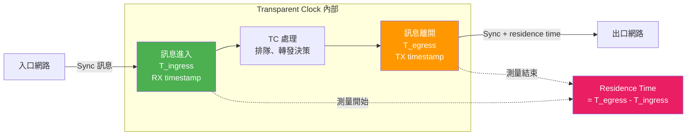
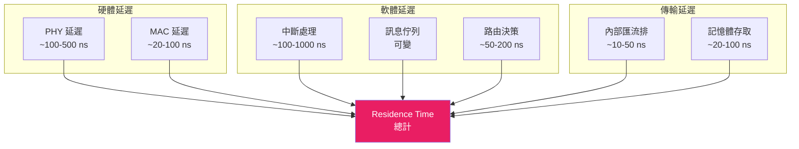
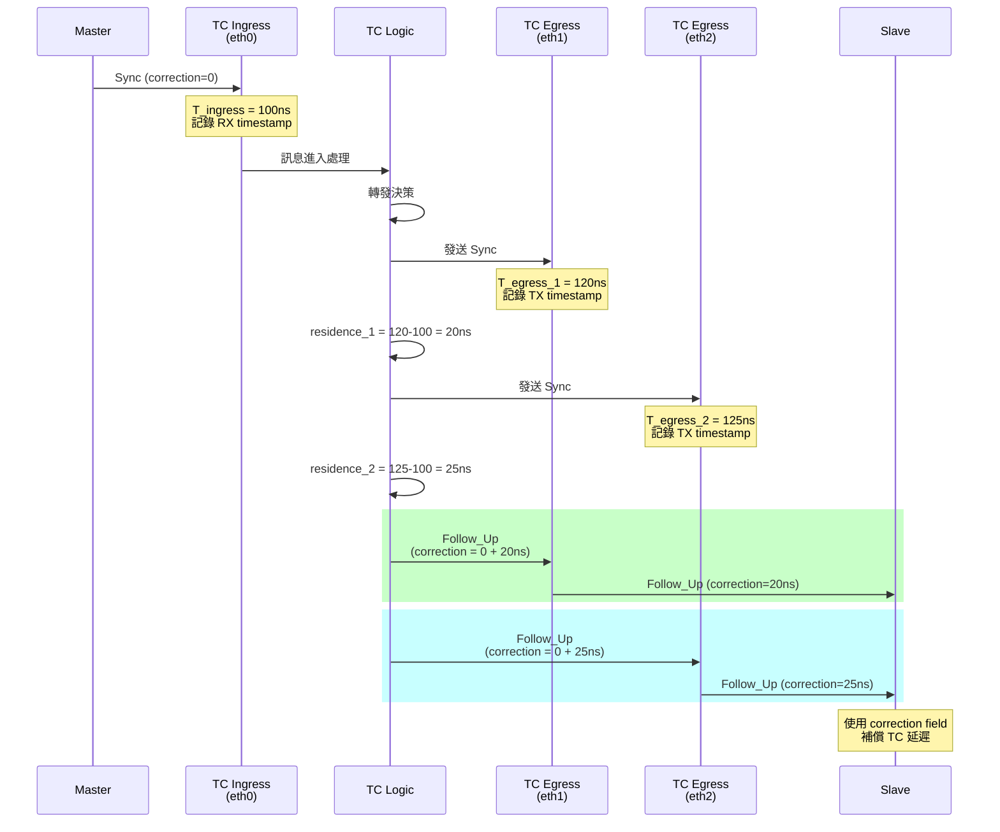
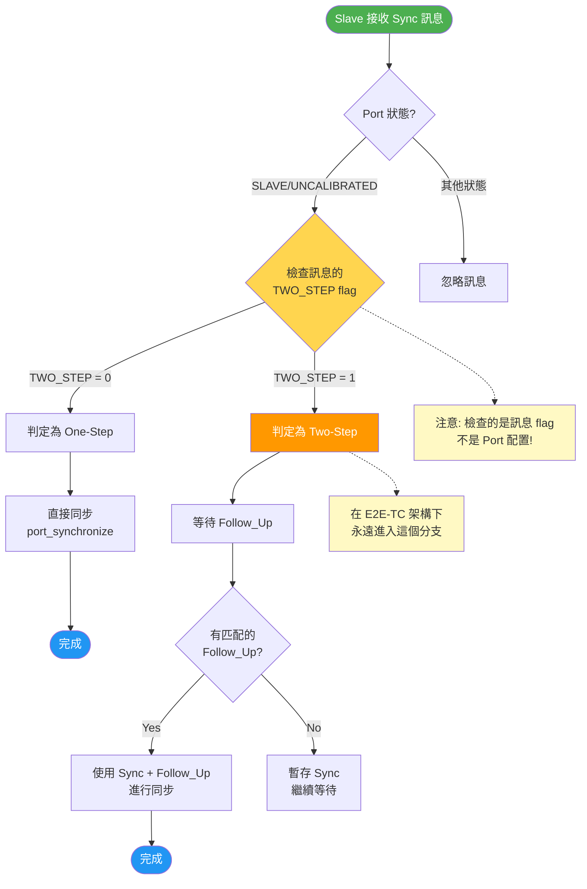
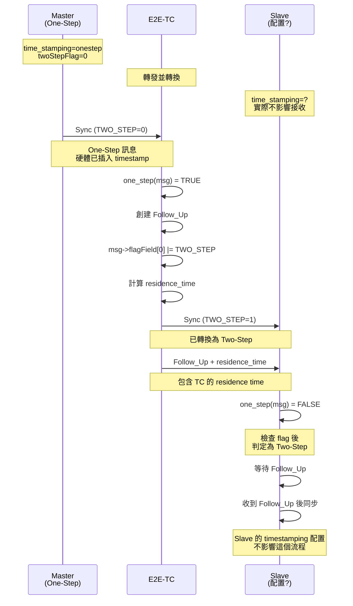
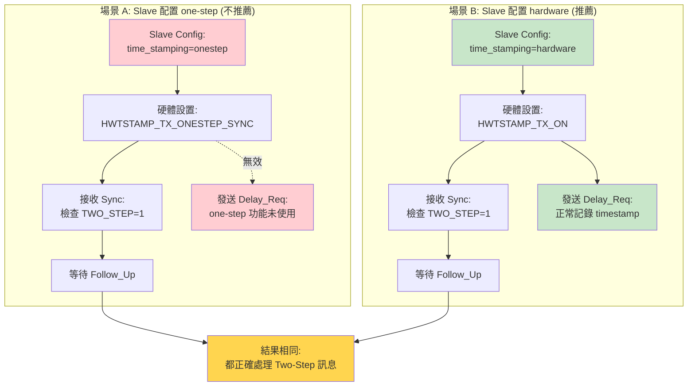
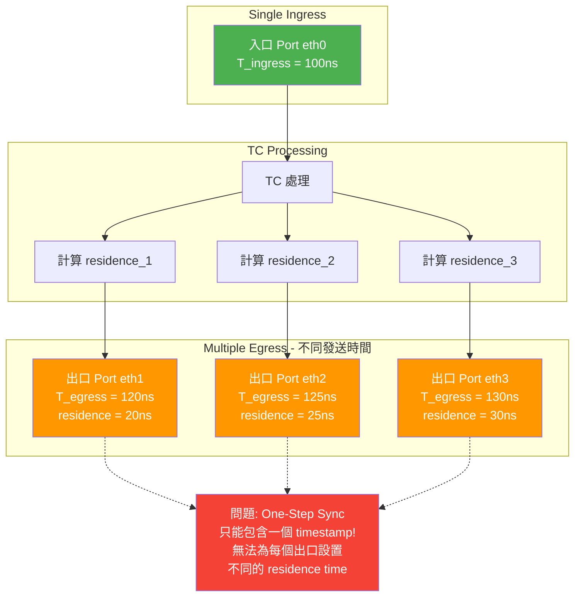
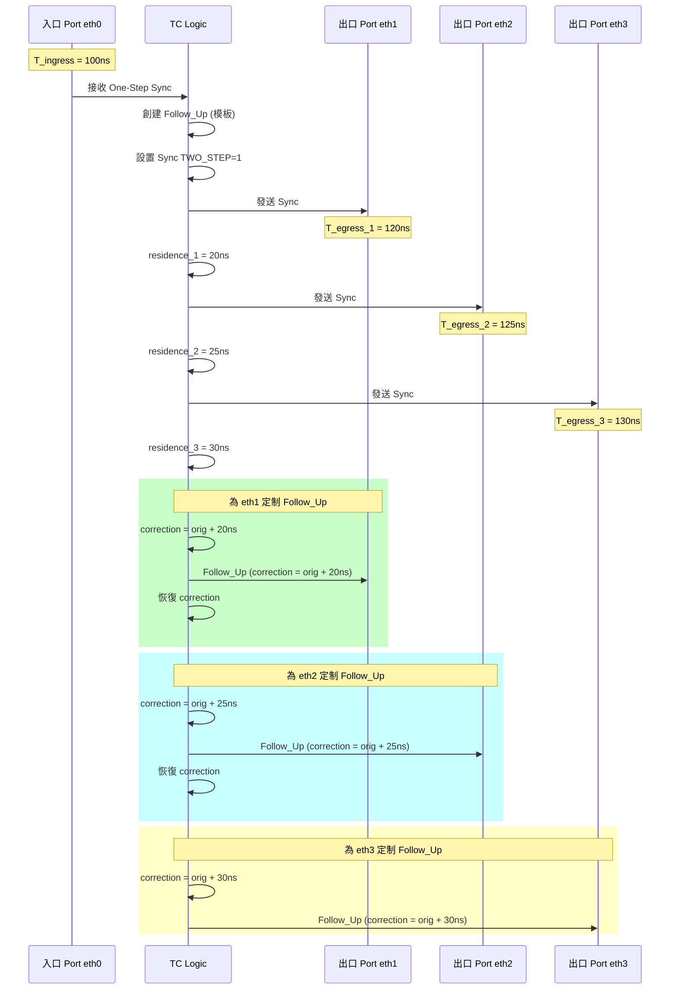
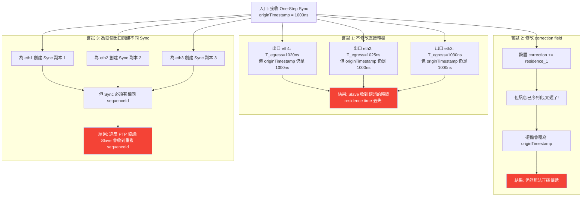
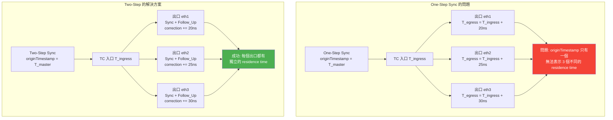

# LinuxPTP 4.2 - E2E Transparent Clock with One-Step & UDPv4 完整技術分析

## 目錄
1. [概述](#概述)
2. [架構圖與流程圖](#架構圖與流程圖)
3. [E2E-TC 啟用機制](#e2e-tc-啟用機制)
4. [One-Step 時間戳機制](#one-step-時間戳機制)
5. [UDPv4 網路傳輸機制](#udpv4-網路傳輸機制)
6. [配置文件設定](#配置文件設定)
7. [代碼流程分析](#代碼流程分析)
8. [Residence Time 詳解](#residence-time-詳解)
9. [關鍵數據結構](#關鍵數據結構)
10. [實際操作指南](#實際操作指南)

---

## 概述

Transparent Clock (TC) 是一種 PTP 設備，它會測量並記錄 PTP 訊息在設備內部的駐留時間 (residence time)，然後將這個時間加到訊息的 correction field 中。E2E-TC (End-to-End Transparent Clock) 使用 E2E 延遲機制來測量延遲。

### 關鍵特性組合

本文分析如何在 linuxptp-4.2 中同時啟用：
- **E2E-TC**: End-to-End Transparent Clock 模式
- **One-Step**: 硬體在發送時直接插入時間戳
- **UDPv4**: 使用 UDP over IPv4 作為網路傳輸層

---

## E2E-TC 啟用機制

### 1. Clock Type 配置

#### 配置項定義 (config.c)

```c
// 第 151-157 行
static struct config_enum clock_type_enu[] = {
	{ "OC",      CLOCK_TYPE_ORDINARY },
	{ "BC",      CLOCK_TYPE_BOUNDARY },
	{ "P2P_TC",  CLOCK_TYPE_P2P      },
	{ "E2E_TC",  CLOCK_TYPE_E2E      },
	{ NULL, 0 },
};
```

#### Clock Type 枚舉 (clock.h)

```c
enum clock_type {
	CLOCK_TYPE_ORDINARY,
	CLOCK_TYPE_BOUNDARY,
	CLOCK_TYPE_P2P,      // P2P Transparent Clock
	CLOCK_TYPE_E2E,      // E2E Transparent Clock
	CLOCK_TYPE_MANAGEMENT,
};
```

### 2. 主程序驗證邏輯 (ptp4l.c)

```c
// 第 232-242 行
case CLOCK_TYPE_E2E:
	if (cfg->n_interfaces < 2) {
		fprintf(stderr, "TC needs at least two interfaces\n");
		goto out;
	}
	if (DM_E2E != config_get_int(cfg, NULL, "delay_mechanism")) {
		fprintf(stderr, "E2E_TC needs E2E delay mechanism\n");
		goto out;
	}
	break;
```

**驗證要求：**
1. 至少需要 2 個網路介面
2. `delay_mechanism` 必須設置為 `E2E`

### 3. Delay Mechanism 設定

#### 配置定義 (config.c)

```c
// 第 172-177 行
static struct config_enum delay_mech_enu[] = {
	{ "Auto", DM_AUTO },
	{ "E2E",  DM_E2E },
	{ "P2P",  DM_P2P },
	{ NULL, 0 },
};

// 第 256 行 - 默認值設定
PORT_ITEM_ENU("delay_mechanism", DM_E2E, delay_mech_enu),
```

### 4. Port Dispatch 函數設定 (port.c)

根據 clock type 決定使用哪個 dispatch 和 event 處理函數：

```c
// 第 3300-3317 行
switch (type) {
case CLOCK_TYPE_ORDINARY:
case CLOCK_TYPE_BOUNDARY:
	p->dispatch = bc_dispatch;
	p->event = bc_event;
	break;
case CLOCK_TYPE_P2P:
	p->dispatch = p2p_dispatch;
	p->event = p2p_event;
	break;
case CLOCK_TYPE_E2E:
	p->dispatch = e2e_dispatch;    // E2E-TC 使用此函數
	p->event = e2e_event;          // E2E-TC 使用此函數
	break;
case CLOCK_TYPE_MANAGEMENT:
	goto err_log_name;
}
```

### 5. E2E TC 訊息處理 (e2e_tc.c)

#### e2e_event() 函數

這是 E2E-TC 的核心訊息處理函數：

```c
// e2e_tc.c 第 77-222 行
enum fsm_event e2e_event(struct port *p, int fd_index)
{
	// ... 接收訊息 ...

	switch (msg_type(msg)) {
	case SYNC:
		if (tc_fwd_sync(p, msg)) {      // 轉發 SYNC 訊息
			event = EV_FAULT_DETECTED;
			break;
		}
		if (dup) {
			process_sync(p, dup);        // 本地處理
		}
		break;
	case DELAY_REQ:
		if (tc_fwd_request(p, msg)) {   // 轉發 Delay Request
			event = EV_FAULT_DETECTED;
		}
		break;
	case FOLLOW_UP:
		if (tc_fwd_folup(p, msg)) {     // 轉發 Follow Up
			event = EV_FAULT_DETECTED;
			break;
		}
		if (dup) {
			process_follow_up(p, dup);
		}
		break;
	case DELAY_RESP:
		if (tc_fwd_response(p, msg)) {  // 轉發 Delay Response
			event = EV_FAULT_DETECTED;
		}
		if (dup) {
			process_delay_resp(p, dup);
		}
		break;
	case ANNOUNCE:
		if (tc_forward(p, msg)) {       // 轉發 Announce
			event = EV_FAULT_DETECTED;
			break;
		}
		if (dup && process_announce(p, dup)) {
			event = EV_STATE_DECISION_EVENT;
		}
		break;
	}

	return event;
}
```

---

## One-Step 時間戳機制

### 1. Timestamping 類型定義 (msg.h)

```c
// 第 75-81 行
enum timestamp_type {
	TS_SOFTWARE,    // 軟體時間戳
	TS_HARDWARE,    // 硬體兩步時間戳
	TS_LEGACY_HW,   // 舊版硬體時間戳
	TS_ONESTEP,     // 硬體單步時間戳 (for Sync)
	TS_P2P1STEP,    // 硬體單步時間戳 (for P2P)
};
```

### 2. 配置項設定 (config.c)

```c
// 第 208-214 行
static struct config_enum timestamping_enu[] = {
	{ "hardware", TS_HARDWARE  },
	{ "software", TS_SOFTWARE  },
	{ "legacy",   TS_LEGACY_HW },
	{ "onestep",  TS_ONESTEP   },    // One-Step 配置字串
	{ "p2p1step", TS_P2P1STEP  },
	{ NULL, 0 },
};

// 第 341 行 - 默認值已改為 TS_ONESTEP
GLOB_ITEM_ENU("time_stamping", TS_ONESTEP, timestamping_enu),
```

### 3. One-Step 判斷函數 (msg.h)

```c
// 第 57 行 - TWO_STEP flag 定義
#define TWO_STEP       (1<<1)

// 第 458-463 行 - one_step() 判斷函數
static inline Boolean one_step(struct ptp_message *m)
{
	if (assume_two_step)
		return 0;
	return !field_is_set(m, 0, TWO_STEP);
}
```

**邏輯說明：**
- 如果全局變數 `assume_two_step` 為真，強制返回 0 (非 one-step)
- 否則檢查訊息 header 的 flag field，若 TWO_STEP bit 未設置則為 one-step

### 4. TC 中的 One-Step 處理 (tc.c)

#### tc_fwd_sync() 函數

```c
// tc.c 第 441-475 行
int tc_fwd_sync(struct port *q, struct ptp_message *msg)
{
	struct ptp_message *fup = NULL;
	int err;

	if (one_step(msg)) {
		// One-Step 模式：自動創建 Follow_Up 訊息
		fup = msg_allocate();
		if (!fup) {
			return -1;
		}
		// 設置 Follow_Up 訊息內容
		fup->header.tsmt               = FOLLOW_UP | (msg->header.tsmt & 0xf0);
		fup->header.ver                = msg->header.ver;
		fup->header.messageLength      = htons(sizeof(struct follow_up_msg));
		fup->header.domainNumber       = msg->header.domainNumber;
		fup->header.sourcePortIdentity = msg->header.sourcePortIdentity;
		fup->header.sequenceId         = msg->header.sequenceId;
		fup->header.logMessageInterval = msg->header.logMessageInterval;
		fup->follow_up.preciseOriginTimestamp = msg->sync.originTimestamp;

		// 將原本的 Sync 訊息改為 Two-Step (設置 TWO_STEP flag)
		msg->header.flagField[0]      |= TWO_STEP;
	}

	err = tc_fwd_event(q, msg);
	if (err) {
		return err;
	}

	// 如果創建了 Follow_Up，也要轉發它
	if (fup) {
		err = tc_fwd_folup(q, fup);
		msg_put(fup);
	}
	return err;
}
```

**One-Step 轉換邏輯：**
1. 檢測到 one-step Sync 訊息時，TC 會：
   - 創建對應的 Follow_Up 訊息
   - 將 Sync 訊息的 TWO_STEP flag 設置為 1（轉換為 two-step）
   - 先轉發 Sync，再轉發 Follow_Up
2. 這樣做的原因：TC 需要在 Follow_Up 中加入 residence time

### 5. 硬體時間戳初始化 (sk.c)

```c
// sk.c 第 596-610 行
switch (type) {
case TS_SOFTWARE:
	tx_type = HWTSTAMP_TX_OFF;
	break;
case TS_HARDWARE:
case TS_LEGACY_HW:
	tx_type = HWTSTAMP_TX_ON;
	break;
case TS_ONESTEP:
	tx_type = HWTSTAMP_TX_ONESTEP_SYNC;    // 設置硬體為 One-Step Sync 模式
	break;
case TS_P2P1STEP:
	tx_type = HWTSTAMP_TX_ONESTEP_P2P;
	break;
}
```

**硬體設定：**
- `HWTSTAMP_TX_ONESTEP_SYNC`：告訴網卡驅動在發送 Sync 訊息時自動插入發送時間戳

### 6. Config Harmonization (config.c)

```c
// config.c 第 1046-1076 行
int config_harmonize_onestep(struct config *cfg)
{
	enum timestamp_type tstype = config_get_int(cfg, NULL, "time_stamping");
	int two_step_flag = config_get_int(cfg, NULL, "twoStepFlag");

	switch (tstype) {
	case TS_SOFTWARE:
	case TS_LEGACY_HW:
		if (!two_step_flag) {
			// 軟體時間戳必須使用 two-step
			return -1;
		}
		break;
	case TS_HARDWARE:
		if (!two_step_flag) {
			// 如果設置 twoStepFlag=0，自動升級為 TS_ONESTEP
			pr_debug("upgrading to one step time stamping "
				 "in order to match the twoStepFlag");
			if (config_set_int(cfg, "time_stamping", TS_ONESTEP)) {
				return -1;
			}
		}
		break;
	case TS_ONESTEP:
	case TS_P2P1STEP:
		if (two_step_flag) {
			// One-step 必須設置 twoStepFlag=0
			pr_err("one step is only possible with twoStepFlag set to 0");
			return -1;
		}
		break;
	}
	return 0;
}
```

**配置協調邏輯：**
- `twoStepFlag=0` + `time_stamping=hardware` → 自動升級為 `TS_ONESTEP`
- `twoStepFlag=0` + `time_stamping=onestep` → 正常
- `twoStepFlag=1` + `time_stamping=onestep` → 錯誤

---

## UDPv4 網路傳輸機制

### 1. Network Transport 類型定義

#### Transport Type 枚舉 (transport_private.h / transport.h)

```c
enum transport_type {
	TRANS_UDS,           // Unix Domain Socket
	TRANS_UDP_IPV4,      // UDP over IPv4
	TRANS_UDP_IPV6,      // UDP over IPv6
	TRANS_IEEE_802_3,    // Raw Ethernet (Layer 2)
	TRANS_DEVICENET,
	TRANS_CONTROLNET,
	TRANS_PROFINET,
};
```

#### 配置枚舉 (config.c)

```c
// 第 201-206 行
static struct config_enum nw_trans_enu[] = {
	{ "UDPv4", TRANS_UDP_IPV4   },    // 配置字串
	{ "UDPv6", TRANS_UDP_IPV6   },
	{ "L2",    TRANS_IEEE_802_3 },
	{ NULL, 0 },
};

// 第 298 行 - 默認值
PORT_ITEM_ENU("network_transport", TRANS_UDP_IPV4, nw_trans_enu),
```

### 2. Transport 創建 (transport.c)

```c
// transport.c 第 101-128 行
struct transport *transport_create(struct config *cfg,
				   enum transport_type type)
{
	struct transport *t = NULL;
	switch (type) {
	case TRANS_UDS:
		t = uds_transport_create();
		break;
	case TRANS_UDP_IPV4:
		t = udp_transport_create();    // 創建 UDPv4 傳輸層
		break;
	case TRANS_UDP_IPV6:
		t = udp6_transport_create();
		break;
	case TRANS_IEEE_802_3:
		t = raw_transport_create();
		break;
	case TRANS_DEVICENET:
	case TRANS_CONTROLNET:
	case TRANS_PROFINET:
		break;
	}
	if (t) {
		t->type = type;
		t->cfg = cfg;
	}
	return t;
}
```

### 3. UDP Transport 實現 (udp.c)

#### 數據結構

```c
struct udp {
	struct transport t;
	struct address ip;
	struct address mac;
};
```

#### UDP Transport 創建函數

```c
// udp.c 第 312-327 行
struct transport *udp_transport_create(void)
{
	struct udp *udp = calloc(1, sizeof(*udp));
	if (!udp)
		return NULL;
	udp->t.open      = udp_open;
	udp->t.recv      = udp_recv;
	udp->t.send      = udp_send;
	udp->t.release   = udp_release;
	udp->t.physical_addr = udp_physical_addr;
	udp->t.protocol_addr = udp_protocol_addr;
	return &udp->t;
}
```

#### UDP Open 函數

```c
// udp.c 第 164-275 行
static int udp_open(struct transport *t, struct interface *iface,
		    struct fdarray *fda, enum timestamp_type ts_type)
{
	struct udp *udp = container_of(t, struct udp, t);
	// ...

	// 創建 UDP socket 並綁定到對應的 multicast 地址
	efd = open_socket(iface, event_mcast, mac, 0, ts_type);
	if (efd < 0)
		goto no_event;

	gfd = open_socket(iface, general_mcast, mac, 1, ts_type);
	if (gfd < 0)
		goto no_general;

	// 設置 file descriptors
	fda->fd[FD_EVENT] = efd;
	fda->fd[FD_GENERAL] = gfd;

	return 0;
	// ...
}
```

#### Open Socket 函數

```c
// udp.c 第 73-161 行
static int open_socket(struct interface *iface,
		       struct in_addr mcast, unsigned char *mac, int event,
		       enum timestamp_type ts_type)
{
	struct sockaddr_in addr;
	int fd, index, on = 1, dscp;

	// 創建 UDP socket
	fd = socket(PF_INET, SOCK_DGRAM, IPPROTO_UDP);
	if (fd < 0) {
		pr_err("socket failed: %m");
		goto no_socket;
	}

	// 設置 socket 選項
	index = interface_index(iface);
	// ... 設置 SO_REUSEADDR, IP_MULTICAST_LOOP 等選項 ...

	// 綁定到指定端口 (Event: 319, General: 320)
	addr.sin_family = AF_INET;
	addr.sin_addr.s_addr = htonl(INADDR_ANY);
	addr.sin_port = htons(event ? EVENT_PORT : GENERAL_PORT);
	if (bind(fd, (struct sockaddr *) &addr, sizeof(addr)) < 0) {
		pr_err("bind failed: %m");
		goto no_bind;
	}

	// 加入 multicast 群組
	if (mcast_join(fd, index, &mcast, iface)) {
		pr_err("mcast_join failed");
		goto no_mcast;
	}

	// 初始化硬體時間戳
	if (sk_timestamping_init(fd, interface_label(iface), ts_type,
				 TRANS_UDP_IPV4, interface_vclock(iface))) {
		goto no_timestamping;
	}

	return fd;
	// ...
}
```

**重要細節：**
- Event Messages 使用端口 319
- General Messages 使用端口 320
- 自動加入 PTP multicast 群組
- 啟用硬體時間戳功能

#### Multicast 地址

```c
// udp.c 第 31-34 行
static struct in_addr mcast_addr[2] = {
	[MC_PRIMARY] = {PTP_PRIMARY_MCAST_IPADDR},    // 224.0.1.129
	[MC_PDELAY]  = {PTP_PDELAY_MCAST_IPADDR},     // 224.0.0.107
};
```

### 4. Port 中的 Transport 初始化 (port.c)

```c
// port.c 第 3324-3328 行
p->trp = transport_create(cfg, config_get_int(cfg,
		      interface_name(interface), "network_transport"));
if (!p->trp) {
	goto err_log_name;
}
```

---

## 配置文件設定

### 1. E2E-TC 標準配置

#### 現有範例 (configs/E2E-TC.cfg)

```cfg
#
# End to End Transparent Clock example configuration containing
# those attributes which differ from the defaults.  See the file,
# default.cfg, for the complete list of available options.
#
[global]
priority1		254
free_running		1
freq_est_interval	3
tc_spanning_tree	1
summary_interval	1
clock_type		E2E_TC
network_transport	L2
```

**注意：** 此配置使用 L2 (Layer 2 Raw Ethernet) 傳輸。

### 2. E2E-TC + One-Step + UDPv4 配置

#### 完整配置範例

```cfg
#
# E2E Transparent Clock with One-Step and UDPv4
#
[global]
# Clock Type - E2E Transparent Clock
clock_type              E2E_TC

# Network Transport - UDPv4
network_transport       UDPv4

# Time Stamping - One-Step Hardware
time_stamping           onestep
twoStepFlag             0

# TC 特定設定
priority1               254
free_running            1
freq_est_interval       3
tc_spanning_tree        1

# Delay Mechanism - 必須是 E2E
delay_mechanism         E2E

# 日誌設定
summary_interval        1
logging_level           6
verbose                 1
use_syslog              1

# Domain 設定
domainNumber            0

# 其他重要設定
assume_two_step         0
```

### 3. 配置選項詳解

| 配置項 | 值 | 說明 |
|--------|-----|------|
| `clock_type` | `E2E_TC` | 設置為 E2E Transparent Clock 模式 |
| `network_transport` | `UDPv4` | 使用 UDP over IPv4 傳輸 |
| `time_stamping` | `onestep` | 啟用硬體單步時間戳 |
| `twoStepFlag` | `0` | 必須設為 0 才能使用 one-step |
| `delay_mechanism` | `E2E` | 使用 E2E 延遲機制 (E2E-TC 要求) |
| `priority1` | `254` | TC 不應成為 Grandmaster，設置低優先級 |
| `free_running` | `1` | TC 不同步本地時鐘，只轉發訊息 |
| `tc_spanning_tree` | `1` | 啟用生成樹協議支援，避免環路 |
| `assume_two_step` | `0` | 不假設所有訊息都是 two-step |

### 4. 命令行選項

也可以通過命令行參數啟動：

```bash
# 使用配置文件
ptp4l -f e2e_tc_onestep_udpv4.cfg -i eth0 -i eth1

# 或使用命令行參數（部分設定）
ptp4l -E -4 -i eth0 -i eth1 -f custom.cfg

# 選項說明：
#   -E : E2E delay mechanism
#   -4 : UDP IPv4 transport
#   -i : 指定介面（TC 需要至少 2 個）
#   -f : 配置文件
```

**注意：** Clock type 無法通過命令行設置，必須在配置文件中指定。

---

## 代碼流程分析

### 1. 初始化流程

```
main() [ptp4l.c]
  ↓
config_create() & config_read()
  ↓
驗證 clock_type = CLOCK_TYPE_E2E
  ├─ 檢查至少 2 個介面
  └─ 檢查 delay_mechanism = DM_E2E
  ↓
clock_create(CLOCK_TYPE_E2E, cfg, phc_device) [clock.c]
  ↓
config_harmonize_onestep(cfg)
  ├─ 檢查 time_stamping 與 twoStepFlag 一致性
  └─ 必要時自動調整
  ↓
對每個介面調用 clock_add_port()
  ↓
port_open() [port.c]
  ├─ 根據 CLOCK_TYPE_E2E 設置：
  │   p->dispatch = e2e_dispatch
  │   p->event = e2e_event
  ├─ 創建 transport：
  │   transport_create(TRANS_UDP_IPV4)
  │     └─ udp_transport_create() [udp.c]
  └─ 打開 transport：
      transport_open()
        └─ udp_open()
            ├─ open_socket() for Event (port 319)
            ├─ open_socket() for General (port 320)
            └─ sk_timestamping_init(TS_ONESTEP)
                └─ 設置 tx_type = HWTSTAMP_TX_ONESTEP_SYNC
  ↓
port_dispatch(p, EV_INITIALIZE, 0)
```

### 2. Sync 訊息轉發流程 (One-Step 模式)

```
接收到 Sync 訊息
  ↓
e2e_event() [e2e_tc.c]
  ├─ transport_recv() 接收訊息
  ├─ 檢查 msg_type(msg) == SYNC
  └─ 調用 tc_fwd_sync(p, msg)
      ↓
tc_fwd_sync() [tc.c]
  ├─ 檢測 one_step(msg) == true
  ├─ 創建 Follow_Up 訊息：
  │   fup = msg_allocate()
  │   設置 fup 內容（從 Sync 複製）
  │   msg->header.flagField[0] |= TWO_STEP
  ├─ tc_fwd_event(q, msg) - 轉發 Sync
  │   ↓
  │   tc_fwd_event() 對每個出口 port：
  │     ├─ 檢查 tc_blocked() - 過濾被阻擋的 port
  │     ├─ port_send_msg(p, msg) - 發送訊息
  │     ├─ 記錄 ingress & egress timestamps
  │     └─ tc_complete_request() - 計算並保存 residence time
  │
  └─ tc_fwd_folup(q, fup) - 轉發 Follow_Up
      ↓
      對每個出口 port：
        ├─ 檢查 tc_blocked()
        └─ tc_complete() - 將 residence time 加入 correction field
            └─ port_send_msg() - 發送 Follow_Up
```

### 3. Delay Request/Response 流程

```
接收到 Delay_Req
  ↓
e2e_event()
  └─ tc_fwd_request(p, msg)
      └─ tc_fwd_event()
          └─ 記錄每個出口的 residence time

接收到 Delay_Resp
  ↓
e2e_event()
  └─ tc_fwd_response(p, msg)
      └─ 對每個出口 port：
          tc_complete()
            ├─ 查找對應的 Delay_Req residence time
            └─ 將 residence time 加入 correction field
```

### 4. 時間戳記錄

```
發送訊息時：
  port_send_msg() [port.c]
    ↓
  transport_send()
    └─ udp_send() [udp.c]
        └─ sendmsg() 系統調用

接收 TX timestamp：
  poll() 偵測到 socket 可讀
    ↓
  sk_receive() [sk.c]
    ├─ recvmsg() 取得 timestamp
    └─ 根據 timestamp_type:
        case TS_ONESTEP:
          - 不期待 TX timestamp (硬體已自動處理)
        case TS_HARDWARE:
          - 解析並保存 TX timestamp
```

### 5. Residence Time 計算

```
TC Residence Time = T_egress - T_ingress

T_ingress: 訊息進入 TC 的時間 (RX timestamp)
T_egress:  訊息離開 TC 的時間 (TX timestamp)

在 one-step 模式下：
  - Sync: 硬體自動在發送時插入時間戳，TC 需轉換為 two-step
  - Follow_Up: TC 將 residence time 加入 correction field
  - Delay_Resp: TC 將 residence time 加入 correction field
```

---

## Residence Time 詳解

### 什麼是 Residence Time？

**Residence Time（駐留時間）** 是 Transparent Clock 的核心概念，指的是 PTP 訊息在 TC 設備**內部**停留的時間，從訊息進入設備到離開設備的時間差。

### 數學定義

```
Residence Time = T_egress - T_ingress

其中：
• T_ingress: 訊息進入 TC 的時間（RX timestamp）
• T_egress:  訊息離開 TC 的時間（TX timestamp）
```

### 代碼實現

從 `tc.c` 第 267-307 行可以看到核心實現：

```c
static int tc_fwd_event(struct port *q, struct ptp_message *msg)
{
	tmv_t egress, ingress = msg->hwts.ts, residence;
	struct port *p;
	double rr;

	// ingress: 訊息進入時的 RX timestamp
	ingress = msg->hwts.ts;

	/* 第一步：發送訊息到所有出口 */
	for (p = clock_first_port(q->clock); p; p = LIST_NEXT(p, list)) {
		if (tc_blocked(q, p, msg)) {
			continue;
		}
		// 發送訊息
		transport_send(p->trp, &p->fda, TRANS_DEFER_EVENT, msg);
	}

	/* 第二步：收集每個出口的 TX timestamp */
	for (p = clock_first_port(q->clock); p; p = LIST_NEXT(p, list)) {
		if (tc_blocked(q, p, msg)) {
			continue;
		}

		// 獲取這個出口的 TX timestamp
		transport_txts(&p->fda, msg);

		// 加上 offset 校正
		ts_add(&msg->hwts.ts, p->tx_timestamp_offset);

		// egress: 訊息離開時的 TX timestamp
		egress = msg->hwts.ts;

		// *** 計算 residence time ***
		residence = tmv_sub(egress, ingress);

		// 如果時鐘頻率不是 1.0，需要校正
		rr = clock_rate_ratio(q->clock);
		if (rr != 1.0) {
			residence = dbl_tmv(tmv_dbl(residence) * rr);
		}

		// 完成處理：將 residence time 添加到訊息
		tc_complete(q, p, msg, residence);
	}

	return 0;
}
```

### 視覺化說明



### 詳細時間線範例

```
時間軸（單位：奈秒）：

T = 1000000000 ns
    ↓
    Master 發送 Sync

T = 1000000100 ns (T_ingress)
    ↓
    [進入 TC eth0 接口]
    ├─ 硬體接收訊息
    ├─ 記錄 RX timestamp = 1000000100 ns
    └─ 訊息進入 TC 處理佇列

T = 1000000105 ns
    ↓
    [TC 內部處理]
    ├─ 訊息分類
    ├─ 轉發決策
    ├─ 檢查 spanning tree
    └─ 決定從 eth1, eth2 轉發

T = 1000000120 ns (T_egress_1 for eth1)
    ↓
    [離開 TC eth1 接口]
    ├─ 硬體發送訊息
    ├─ 記錄 TX timestamp = 1000000120 ns
    └─ Residence Time (eth1) = 1000000120 - 1000000100 = 20 ns

T = 1000000125 ns (T_egress_2 for eth2)
    ↓
    [離開 TC eth2 接口]
    ├─ 硬體發送訊息
    ├─ 記錄 TX timestamp = 1000000125 ns
    └─ Residence Time (eth2) = 1000000125 - 1000000100 = 25 ns
```

### Residence Time 的組成部分



### 為什麼 Residence Time 重要？

#### 1. 時間同步精度

如果不補償 residence time，Slave 計算的時間會不準確：

```
沒有 TC 補償：
Master ─(100ns)─> Slave
Slave 時間差 = 100 ns ✅ 正確

有 TC 但不補償：
Master ─(50ns)─> TC ─(30ns residence)─(50ns)─> Slave
Slave 時間差 = 100 ns（但實際應該是 100 + 30 = 130 ns）❌ 錯誤！

有 TC 且補償：
Master ─(50ns)─> TC ─(residence=30ns added)─(50ns)─> Slave
Slave 時間差 = 100 + 30 = 130 ns ✅ 正確！
```

#### 2. 多級 TC 累積

在多個 TC 級聯的情況下，每個 TC 都會添加自己的 residence time：

```
Master → TC1 → TC2 → TC3 → Slave

最終 correction field =
    original_correction
    + residence_time_TC1
    + residence_time_TC2
    + residence_time_TC3
```


### Residence Time 的添加過程

**對於 Sync + Follow_Up：**

```c
// tc.c 第 177-230 行
static void tc_complete_syfup(struct port *q, struct port *p,
                              struct ptp_message *msg, tmv_t residence)
{
	struct ptp_message *fup;
	Integer64 c1, c2;

	// 查找對應的 Follow_Up 訊息
	// ...

	// 讀取原始 correction field
	c1 = net2host64(fup->header.correction);

	// *** 關鍵：添加 residence time ***
	c2 = c1 + tmv_to_TimeInterval(residence);

	// 還要加上其他延遲
	c2 += tmv_to_TimeInterval(q->peer_delay);  // P2P 延遲
	c2 += q->asymmetry;                         // 非對稱延遲補償

	// 設置新的 correction field
	fup->header.correction = host2net64(c2);

	// 發送 Follow_Up
	transport_send(p->trp, &p->fda, TRANS_GENERAL, fup);

	// 恢復原始值供下一個出口使用
	fup->header.correction = host2net64(c1);
}
```

**對於 Delay_Resp：**

```c
// tc.c 第 140-175 行
static void tc_complete_response(struct port *q, struct port *p,
                                 struct ptp_message *resp, tmv_t residence)
{
	struct tc_txd *txd;
	Integer64 c1, c2;

	// 查找對應的 Delay_Req
	TAILQ_FOREACH(txd, &p->tc_transmitted, list) {
		type = tc_match_delay(portnum(p), resp, txd);
		if (type == TC_DELAY_REQRESP) {
			residence = txd->residence;  // 使用保存的 residence time
			break;
		}
	}

	// 讀取原始 correction
	c1 = net2host64(resp->header.correction);

	// 添加 residence time
	c2 = c1 + tmv_to_TimeInterval(residence);

	// 設置新的 correction
	resp->header.correction = host2net64(c2);

	// 發送 Delay_Resp
	transport_send(p->trp, &p->fda, TRANS_GENERAL, resp);
}
```

### 數據結構

TC 使用 `tc_txd` 結構來儲存每個出口的 residence time：

```c
// tc.c 內部結構
struct tc_txd {
	TAILQ_ENTRY(tc_txd)  list;
	struct ptp_message   *msg;           // 關聯的訊息
	tmv_t                residence;      // *** 駐留時間 ***
	unsigned int         ingress_port;   // 入口端口號
};

// 每個 port 維護一個列表
struct port {
	// ... 其他成員 ...
	TAILQ_HEAD(, tc_txd) tc_transmitted;  // 已發送訊息的 residence time 列表
	// ...
};
```

### 典型數值範圍

| 設備類型 | 典型 Residence Time | 說明 |
|---------|-------------------|------|
| 高性能硬體 TC | 100-500 ns | 專用 ASIC，最小延遲 |
| Linux 軟體 TC | 1-10 μs | 軟體處理，有作業系統開銷 |
| 低階嵌入式 TC | 500 ns - 5 μs | 取決於 CPU 性能 |
| 繁忙網路下 | 可達 100 μs | 佇列延遲增加 |

### 實際計算範例

**範例情境：**

```
假設：
- Master originTimestamp = 1000000000.000000000 ns
- TC ingress timestamp   = 1000000000.100000000 ns
- TC egress timestamp    = 1000000000.100000020 ns
- 網路延遲到 Slave      = 50000 ns

計算步驟：

1. Residence time = T_egress - T_ingress
                  = 1000000000.100000020 - 1000000000.100000000
                  = 20 ns

2. TC 更新 Correction field:
   correction_new = correction_old + residence_time
                  = 0 + 20 ns
                  = 20 ns

3. Slave 接收訊息:
   - 接收時間 = 1000000000.100050020 ns
   - originTimestamp = 1000000000.000000000 ns
   - correction = 20 ns

4. Slave 計算時間偏移:
   Offset = (Slave 接收時間) - (originTimestamp + correction)
          = 1000000000.100050020 - (1000000000.000000000 + 0.000000020)
          = 100050000 ns

   ✅ 這個值正確地包含了 TC 的 residence time 補償！
```

### IEEE 1588 標準定義

根據 IEEE 1588-2008/2019 標準：

> **Residence Time**: The time interval from reception of a message timestamp point at the ingress port of a bridge or switch to transmission of the message timestamp point at the egress port.

**關鍵要求：**
- ✅ 必須精確測量（硬體 timestamp）
- ✅ 必須添加到 correction field
- ✅ 可以硬體或軟體實現
- ✅ 精度直接影響同步品質
- ✅ 支持多級 TC 累積

### Correction Field 格式

```c
// PTP Header 中的 correction field
struct ptp_header {
	// ... 其他欄位 ...
	Integer64 correction;  // 64-bit signed integer
	// 單位：nanoseconds × 2^16
	// 範圍：±2^47 ns（約 ±3.9 小時）
	// 精度：2^-16 ns（約 15 皮秒）
};

// 轉換函數
Integer64 tmv_to_TimeInterval(tmv_t t) {
	return tmv_to_nanoseconds(t) << 16;  // 乘以 2^16
}
```

### 完整處理流程圖



### 總結表

| 項目 | 說明 |
|------|------|
| **定義** | 訊息在 TC 內部停留的時間 |
| **計算公式** | `T_egress - T_ingress` |
| **測量點** | 硬體 timestamp（PHY/MAC 層） |
| **添加位置** | PTP 訊息的 correction field |
| **單位** | 奈秒（correction field 為 ns × 2^16） |
| **典型值** | 100 ns - 10 μs |
| **精度要求** | 越高越好，直接影響同步精度 |
| **標準依據** | IEEE 1588-2008/2019 |
| **關鍵作用** | 補償 TC 延遲，確保時間同步精度 |
| **多級支持** | 可在多個 TC 間累積 |

---

## 關鍵數據結構

### 1. struct port

```c
// port_private.h
struct port {
	// 基本屬性
	char                 *name;
	int                  portnum;
	struct clock         *clock;
	struct transport     *trp;           // Transport 層指標
	enum timestamp_type  timestamping;   // TS_ONESTEP

	// Event 處理函數
	enum fsm_event       (*event)(struct port *p, int fd_index);
	void                 (*dispatch)(struct port *p, enum fsm_event event, int mdiff);

	// TC 相關
	TAILQ_HEAD(, tc_txd) tc_transmitted; // 已發送訊息的 residence time 列表
	int                  tc_spanning_tree;

	// 狀態
	enum port_state      state;

	// File descriptors
	struct fdarray       fda;

	// ... 其他成員 ...
};
```

### 2. struct tc_txd

TC 發送數據 (Transparent Clock Transmitted Data)：

```c
// tc.c 內部結構
struct tc_txd {
	TAILQ_ENTRY(tc_txd)  list;
	struct ptp_message   *msg;           // 關聯的訊息
	tmv_t                residence;      // 駐留時間
	unsigned int         ingress_port;   // 進入端口
};
```

### 3. struct ptp_message

```c
// msg.h
struct ptp_message {
	union {
		struct ptp_header              header;
		struct announce_msg            announce;
		struct sync_msg                sync;
		struct delay_req_msg           delay_req;
		struct follow_up_msg           follow_up;
		struct delay_resp_msg          delay_resp;
		struct pdelay_req_msg          pdelay_req;
		struct pdelay_resp_msg         pdelay_resp;
		struct pdelay_resp_fup_msg     pdelay_resp_fup;
		// ...
	};

	struct hw_timestamp  hwts;           // 硬體時間戳
	struct timespec      ts;             // 軟體時間戳

	// ... 其他成員 ...
};
```

### 4. struct transport

```c
// transport_private.h
struct transport {
	enum transport_type type;
	struct config       *cfg;

	// 函數指標
	int (*open)(struct transport *t, struct interface *iface,
		    struct fdarray *fda, enum timestamp_type tt);
	int (*recv)(struct transport *t, int fd, void *buf, int buflen,
		    struct address *addr, struct hw_timestamp *hwts);
	int (*send)(struct transport *t, struct fdarray *fda,
		    enum transport_event event, int peer, void *buf, int len,
		    struct address *addr, struct hw_timestamp *hwts);
	void (*release)(struct transport *t);
	int (*physical_addr)(struct transport *t, uint8_t *addr);
	int (*protocol_addr)(struct transport *t, uint8_t *addr);
};
```

### 5. struct udp (UDPv4 實現)

```c
// udp.c
struct udp {
	struct transport t;
	struct address   ip;     // IPv4 地址
	struct address   mac;    // MAC 地址
};
```

---

## 實際操作指南

### 1. 系統要求

**硬體要求：**
- 支持 PTP 硬體時間戳的網卡 (支持 `HWTSTAMP_TX_ONESTEP_SYNC`)
- 至少 2 個網路介面

**軟體要求：**
- Linux kernel 支持 `SO_TIMESTAMPING`
- 網卡驅動支持 one-step 模式

**驗證硬體支持：**
```bash
# 檢查時間戳功能
ethtool -T eth0

# 應該看到類似輸出：
# Timestamping parameters for eth0:
# Capabilities:
#   hardware-transmit     (SOF_TIMESTAMPING_TX_HARDWARE)
#   hardware-receive      (SOF_TIMESTAMPING_RX_HARDWARE)
#   hardware-raw-clock    (SOF_TIMESTAMPING_RAW_HARDWARE)
# PTP Hardware Clock: 0
# Hardware Transmit Timestamp Modes:
#   off                   (HWTSTAMP_TX_OFF)
#   on                    (HWTSTAMP_TX_ON)
#   onestep-sync          (HWTSTAMP_TX_ONESTEP_SYNC)  ← 必須支持
```

### 2. 配置步驟

#### Step 1: 創建配置文件

創建 `e2e_tc_onestep_udpv4.cfg`：

```cfg
[global]
clock_type              E2E_TC
network_transport       UDPv4
time_stamping           onestep
twoStepFlag             0
delay_mechanism         E2E
priority1               254
free_running            1
freq_est_interval       3
tc_spanning_tree        1
summary_interval        1
logging_level           6
verbose                 1
use_syslog              0
domainNumber            0
assume_two_step         0
```

#### Step 2: 啟動 E2E-TC

```bash
# 基本啟動 (至少 2 個介面)
sudo ptp4l -f e2e_tc_onestep_udpv4.cfg -i eth0 -i eth1 -m

# 帶調試信息
sudo ptp4l -f e2e_tc_onestep_udpv4.cfg -i eth0 -i eth1 -l 7 -m

# 指定 PHC 設備
sudo ptp4l -f e2e_tc_onestep_udpv4.cfg -i eth0 -i eth1 -p /dev/ptp0 -m
```

### 3. 驗證運行狀態

#### 檢查日誌輸出

正常運行的日誌應包含：

```
ptp4l[123.456]: selected /dev/ptp0 as PTP clock
ptp4l[123.457]: port 1 (eth0): INITIALIZING to LISTENING on INIT_COMPLETE
ptp4l[123.458]: port 2 (eth1): INITIALIZING to LISTENING on INIT_COMPLETE
ptp4l[123.459]: port 1 (eth0): link up
ptp4l[123.460]: port 2 (eth1): link up
```

#### 監控 PTP 訊息

使用 tcpdump 或 Wireshark 捕獲 PTP 訊息：

```bash
# 捕獲 PTP 訊息 (UDPv4 使用端口 319 和 320)
sudo tcpdump -i eth0 -n 'udp port 319 or udp port 320'

# 或使用 multicast 地址過濾
sudo tcpdump -i eth0 -n 'host 224.0.1.129 or host 224.0.0.107'
```

#### 檢查時間戳功能

```bash
# 檢查 PTP 硬體時鐘
cat /sys/class/ptp/ptp0/n_vclocks
ls -la /dev/ptp*

# 讀取 PHC 時間
sudo phc_ctl /dev/ptp0 get
```

### 4. Wireshark 分析

**查看 Sync 訊息：**
1. 過濾器：`ptp.v2.messageid == 0x00`
2. 檢查 `flagField`：
   - 來自 Master 的原始 Sync：`TWO_STEP = 0` (one-step)
   - 經過 TC 後的 Sync：`TWO_STEP = 1` (已轉換)

**查看 Follow_Up 訊息：**
1. 過濾器：`ptp.v2.messageid == 0x08`
2. 檢查 `correctionField`：應包含 TC 的 residence time

**查看 Delay_Resp 訊息：**
1. 過濾器：`ptp.v2.messageid == 0x09`
2. 檢查 `correctionField`：應包含累積的 residence time

### 5. 常見問題排查

#### 問題 1: 啟動失敗 "TC needs at least two interfaces"

**原因：** 未指定足夠的網路介面

**解決：**
```bash
# 確保至少指定 2 個介面
sudo ptp4l -f config.cfg -i eth0 -i eth1
```

#### 問題 2: "E2E_TC needs E2E delay mechanism"

**原因：** 配置文件中 `delay_mechanism` 未設置為 `E2E`

**解決：** 在配置文件中添加：
```cfg
delay_mechanism         E2E
```

#### 問題 3: "one step is only possible with twoStepFlag set to 0"

**原因：** `time_stamping=onestep` 但 `twoStepFlag=1`

**解決：** 設置：
```cfg
time_stamping           onestep
twoStepFlag             0
```

#### 問題 4: 網卡不支持 one-step

**症狀：** 時間戳無法正常工作

**檢查：**
```bash
ethtool -T eth0 | grep onestep
```

**解決方案：**
- 使用支持 one-step 的網卡，或
- 改用 `time_stamping = hardware` (two-step 模式)

#### 問題 5: 訊息未轉發

**可能原因：**
1. 端口狀態未就緒
2. Spanning tree 阻擋了轉發
3. 防火牆阻擋 UDP 319/320

**檢查：**
```bash
# 檢查防火牆
sudo iptables -L -n | grep -E '319|320'

# 檢查 multicast 路由
ip maddr show

# 檢查端口狀態
# (查看 ptp4l 日誌中的 port state)
```

### 6. 性能調優

#### 調整日誌等級

```cfg
# 生產環境建議降低日誌等級
logging_level           4
verbose                 0
use_syslog              1
summary_interval        6
```

#### 調整時間戳過濾

```cfg
# 使用硬體時間戳過濾 (如果支持)
hwts_filter             normal
```

#### 調整 Spanning Tree

```cfg
# 如果網路拓撲簡單，可以禁用
tc_spanning_tree        0
```

### 7. 與其他設備互操作

#### 與 OC (Ordinary Clock) 互操作

```
[Master OC] -----> [E2E-TC] -----> [Slave OC]
              eth0           eth1
```

Master 配置 (OC)：
```cfg
clock_type              OC
time_stamping           onestep
delay_mechanism         E2E
```

TC 配置 (本文檔的配置)

Slave 配置 (OC)：
```cfg
clock_type              OC
clientOnly              1
delay_mechanism         E2E
```

#### 與 BC (Boundary Clock) 互操作

E2E-TC 可以透明地轉發 PTP 訊息，BC 會將 TC 添加的 residence time 考慮在內。

---

## Slave 端使用 One-Step 的可行性分析

### 問題：在 E2E-TC 架構中，Slave 端能否配置為 one-step？

這是一個重要的配置問題，讓我們從代碼層面深入分析。

### 1. Slave 端的角色定位

**Slave 的主要功能：**
- **接收 PTP 訊息**：Sync、Follow_Up、Announce
- **發送 PTP 訊息**：Delay_Req
- **同步本地時鐘**：根據接收到的時間信息調整時鐘

**關鍵代碼分析 (port.c):**

```c
// 第 2520-2573 行 - Slave 處理 Sync 訊息
void process_sync(struct port *p, struct ptp_message *m)
{
	enum syfu_event event;

	// 只有在 UNCALIBRATED 或 SLAVE 狀態才處理
	switch (p->state) {
	case PS_UNCALIBRATED:
	case PS_SLAVE:
		break;
	default:
		return;
	}

	// 檢查訊息的 correction field
	m->header.correction += p->asymmetry;

	// 關鍵判斷：檢查是否為 one-step 訊息
	if (one_step(m)) {
		// One-Step 訊息：直接同步，不需要等待 Follow_Up
		port_synchronize(p, m->header.sequenceId,
				 m->hwts.ts, m->ts.pdu,
				 m->header.correction, 0,
				 m->header.logMessageInterval);
		flush_last_sync(p);
		return;
	}

	// Two-Step 訊息：等待 Follow_Up
	if (p->syfu == SF_HAVE_FUP &&
	    fup_sync_ok(p->last_syncfup, m) &&
	    p->last_syncfup->header.sequenceId == m->header.sequenceId) {
		event = SYNC_MATCH;
	} else {
		event = SYNC_MISMATCH;
	}
	port_syfufsm(p, event, m);
}
```

### 2. Slave 的 time_stamping 配置影響範圍

**配置項的實際作用：**

```c
// port.c 第 3389 行
p->timestamping = timestamping;  // 儲存到 port 結構中
```

**Slave 端 timestamping 配置主要影響：**

#### 影響 1: 發送 Delay_Req 的方式

```c
// port.c 第 1576-1631 行
int port_delay_request(struct port *p)
{
	struct ptp_message *msg;

	msg = msg_allocate();
	msg->hwts.type = p->timestamping;  // ← 使用 slave 的 timestamping 設定

	// ... 設置 Delay_Req 內容 ...

	if (port_prepare_and_send(p, msg, TRANS_EVENT)) {
		pr_err("%s: send delay request failed", p->log_name);
		goto out;
	}

	// 檢查是否缺少 timestamp
	if (msg_sots_missing(msg)) {
		pr_err("missing timestamp on transmitted delay request");
		goto out;
	}

	// 記錄發送的 Delay_Req
	TAILQ_INSERT_HEAD(&p->delay_req, msg, list);
	return 0;
}
```

#### 影響 2: 接收訊息時的 timestamp 類型標記

```c
// bc_event() - port.c 第 2953 行
msg->hwts.type = p->timestamping;  // 標記預期的 timestamp 類型
```

**但是：** Slave 接收 Sync 時，判斷是 one-step 還是 two-step **不是看 slave 的配置**，而是**檢查訊息的 TWO_STEP flag**！

### 3. 在 E2E-TC 架構中的訊息流

```
┌──────────┐         ┌──────────┐         ┌──────────┐
│ Master   │         │ E2E-TC   │         │ Slave    │
│ One-Step │         │          │         │ ???      │
└──────────┘         └──────────┘         └──────────┘
      │                    │                    │
      │ Sync               │                    │
      │ TWO_STEP=0         │                    │
      │─────────────────>  │                    │
      │ (One-Step)         │                    │
      │                    │                    │
      │              TC 檢測 one_step(msg)     │
      │              創建 Follow_Up             │
      │              設置 Sync TWO_STEP=1       │
      │                    │                    │
      │                    │ Sync (Two-Step)    │
      │                    │ TWO_STEP=1         │
      │                    │─────────────────>  │
      │                    │                    │ Slave 檢查
      │                    │                    │ one_step(msg)
      │                    │                    │ = FALSE
      │                    │ Follow_Up          │
      │                    │ + residence_time   │
      │                    │─────────────────>  │
      │                    │                    │ 等待 Follow_Up
      │                    │                    │ 然後同步
```

**關鍵觀察：**
- TC 會將 Master 的 one-step Sync **轉換為 two-step**
- Slave 接收到的**永遠是 two-step 格式**的訊息
- Slave 端的 `time_stamping` 配置**不影響**它如何處理接收到的 Sync

### 4. Slave 配置 One-Step 的實際效果

#### 場景 A：Slave 配置 `time_stamping = onestep`

```cfg
# Slave 配置
[global]
clock_type          OC
clientOnly          1
time_stamping       onestep   # ← 配置為 one-step
twoStepFlag         0
delay_mechanism     E2E
```

**實際效果：**

1. **接收 Sync 訊息時：**
   - Slave 檢查訊息的 `TWO_STEP` flag
   - 因為經過 TC，flag 已被設為 1
   - Slave 判斷為 two-step，等待 Follow_Up
   - **Slave 的 one-step 配置不起作用**

2. **發送 Delay_Req 時：**
   - 硬體設置為 `HWTSTAMP_TX_ONESTEP_SYNC`
   - 但 Delay_Req **不是** Sync 訊息！
   - One-step 硬體只對 Sync 有效
   - Delay_Req 仍然使用標準的硬體 timestamp

3. **可能的問題：**
   - 配置不一致（`twoStepFlag=0` 但接收 two-step 訊息）
   - 硬體資源浪費（one-step 功能未使用）
   - 概念混淆（Slave 不發送 Sync）

#### 場景 B：Slave 配置 `time_stamping = hardware` (推薦)

```cfg
# Slave 配置 (推薦)
[global]
clock_type          OC
clientOnly          1
time_stamping       hardware  # ← 配置為標準硬體 two-step
twoStepFlag         1
delay_mechanism     E2E
```

**實際效果：**

1. **接收 Sync 訊息時：**
   - 正確處理 two-step Sync + Follow_Up
   - 配置與實際接收訊息一致

2. **發送 Delay_Req 時：**
   - 使用標準硬體 timestamp
   - 正確記錄發送時間

3. **優點：**
   - 配置清晰正確
   - 與 E2E-TC 架構匹配
   - 無概念混淆

### 5. 代碼驗證

#### 檢查訊息是否為 one-step 的函數 (msg.h)

```c
// 第 458-463 行
static inline Boolean one_step(struct ptp_message *m)
{
	if (assume_two_step)
		return 0;
	return !field_is_set(m, 0, TWO_STEP);  // ← 檢查訊息的 flag，不是 port 配置
}
```

**關鍵點：** 這個函數檢查的是**訊息本身的 flag**，不是 port 的 `timestamping` 配置！

#### TC 轉換 one-step 為 two-step (tc.c)

```c
// 第 447-460 行
if (one_step(msg)) {
	// 創建 Follow_Up
	fup = msg_allocate();
	// ... 設置 Follow_Up 內容 ...

	// 將原本的 Sync 改為 two-step
	msg->header.flagField[0] |= TWO_STEP;  // ← 設置 TWO_STEP flag
}
```

**結果：** 經過 TC 後，Slave 接收到的 Sync 訊息 `TWO_STEP=1`

### 6. 硬體層面分析

#### One-Step 硬體功能

```c
// sk.c 第 602-604 行
case TS_ONESTEP:
	tx_type = HWTSTAMP_TX_ONESTEP_SYNC;  // ← 只對 Sync 有效
	break;
```

**硬體 One-Step 特性：**
- 只對**發送 Sync 訊息**時有效
- 硬體會在發送時自動插入 `originTimestamp`
- 對其他訊息類型（Delay_Req、Follow_Up 等）無效

**Slave 的情況：**
- Slave 不發送 Sync（只有 Master 發送）
- Slave 發送的是 Delay_Req
- 因此 Slave 的 one-step 硬體功能**完全用不上**

### 7. 結論與建議

#### ❌ Slave 配置 one-step 的問題

| 問題 | 說明 |
|------|------|
| **功能無效** | Slave 不發送 Sync，one-step 功能用不到 |
| **接收不匹配** | TC 已轉換為 two-step，Slave 仍收到 two-step 訊息 |
| **配置混淆** | `twoStepFlag=0` 但實際處理 two-step 訊息 |
| **硬體浪費** | One-step 硬體功能啟用但未使用 |
| **語義錯誤** | One-step 是 Master 的特性，不是 Slave 的 |

#### ✅ 正確的 Slave 配置

```cfg
# E2E-TC 架構下的 Slave 配置
[global]
clock_type              OC
clientOnly              1
time_stamping           hardware    # ← 使用標準硬體 two-step
twoStepFlag             1           # ← 與實際接收訊息一致
delay_mechanism         E2E
network_transport       UDPv4

# 其他設定
priority1               255
domainNumber            0
logging_level           6
verbose                 1
```

#### 📊 不同場景的推薦配置

| 角色 | 場景 | time_stamping | twoStepFlag | 說明 |
|------|------|---------------|-------------|------|
| Master | 直連 Slave | `onestep` | `0` | 可使用 one-step 優化 |
| Master | 經過 TC | `onestep` | `0` | 可使用，但 TC 會轉換 |
| TC | E2E-TC | `onestep` | N/A | TC 自動處理轉換 |
| **Slave** | **任何場景** | **`hardware`** | **`1`** | **統一使用 two-step** |
| Slave | 軟體測試 | `software` | `1` | 不需硬體支持 |

### 8. 實驗驗證建議

如果您想驗證這個結論，可以進行以下實驗：

#### 實驗 1：Slave 配置 one-step

```bash
# Slave 端
sudo ptp4l -f slave_onestep.cfg -i eth0 -l 7 -m

# 觀察日誌，您會看到：
# - 接收到的 Sync 訊息 TWO_STEP flag = 1
# - Slave 進入等待 Follow_Up 的狀態
# - One-step 配置實際上沒有被使用
```

#### 實驗 2：Wireshark 抓包分析

```bash
# 在 Slave 端抓包
sudo tcpdump -i eth0 -w slave_packets.pcap 'udp port 319 or udp port 320'

# 用 Wireshark 分析：
# 1. 查看接收到的 Sync 訊息的 flagField
# 2. 確認 TWO_STEP bit 是否被設置
# 3. 觀察是否有對應的 Follow_Up 訊息
```

#### 實驗 3：比較不同配置的同步性能

```bash
# 測試 1：Slave 配置 one-step
time_stamping = onestep

# 測試 2：Slave 配置 hardware
time_stamping = hardware

# 比較同步精度和穩定性
# 結果應該相同，因為實際處理邏輯一樣
```

### 9. 訊息處理流程圖

#### Slave 接收 Sync 訊息的判斷邏輯



#### E2E-TC 架構下完整訊息流



#### 不同配置的對比



### 10. TC 為什麼必須將 One-Step 轉換為 Two-Step？

這是一個非常關鍵的設計問題！讓我們深入分析為什麼不能直接轉發 one-step Sync。

#### 核心問題：每個出口的 Residence Time 不同

**關鍵代碼分析 (tc.c 第 260-310 行):**

```c
static int tc_fwd_event(struct port *q, struct ptp_message *msg)
{
	tmv_t egress, ingress = msg->hwts.ts, residence;
	struct port *p;
	int cnt, err;
	double rr;

	clock_gettime(CLOCK_MONOTONIC, &msg->ts.host);

	/* 第一步：將事件訊息發送到所有出口 */
	for (p = clock_first_port(q->clock); p; p = LIST_NEXT(p, list)) {
		if (tc_blocked(q, p, msg)) {
			continue;
		}
		// 發送 Sync 訊息
		cnt = transport_send(p->trp, &p->fda, TRANS_DEFER_EVENT, msg);
		if (cnt <= 0) {
			pr_err("failed to forward event from %s to %s",
				q->log_name, p->log_name);
		}
	}

	/* 第二步：收集每個出口的發送時間戳 */
	for (p = clock_first_port(q->clock); p; p = LIST_NEXT(p, list)) {
		if (tc_blocked(q, p, msg)) {
			continue;
		}
		// 獲取這個出口的 TX timestamp
		err = transport_txts(&p->fda, msg);
		if (err || !msg_sots_valid(msg)) {
			pr_err("failed to fetch txts on %s to %s event",
				q->log_name, p->log_name);
			continue;
		}

		ts_add(&msg->hwts.ts, p->tx_timestamp_offset);
		egress = msg->hwts.ts;

		// *** 關鍵：計算這個出口的 residence time ***
		residence = tmv_sub(egress, ingress);

		rr = clock_rate_ratio(q->clock);
		if (rr != 1.0) {
			residence = dbl_tmv(tmv_dbl(residence) * rr);
		}

		// *** 關鍵：為這個特定出口保存 residence time ***
		tc_complete(q, p, msg, residence);
	}

	return 0;
}
```

#### 問題分析圖



#### 為什麼 One-Step 不行？

**One-Step Sync 的限制：**

```c
// One-Step Sync 訊息結構
struct sync_msg {
    struct Timestamp originTimestamp;  // 只有一個 timestamp
    // 硬體在發送時會自動填入這個欄位
};
```

**問題 1：只有一個 originTimestamp**
- One-Step Sync 只包含一個 `originTimestamp`
- 硬體在**發送時**自動插入
- 但 TC 有多個出口，每個出口發送時間不同
- **無法在一個 Sync 訊息中為每個出口設置不同的時間**

**問題 2：Correction Field 的限制**

```c
// PTP 訊息 header
struct ptp_header {
    Integer64 correction;  // 以 nanoseconds * 2^16 表示
    // ...
};
```

- Correction field 是在訊息發送**之前**設置的
- One-Step 模式下，硬體發送時才寫入 timestamp
- 此時訊息已經序列化，correction field 已經固定
- **無法在發送時動態修改 correction field**

#### Two-Step 如何解決這個問題

**Two-Step 的優勢：**

```c
// tc.c 第 177-230 行
static void tc_complete_syfup(struct port *q, struct port *p,
			      struct ptp_message *msg, tmv_t residence)
{
	struct tc_txd *txd;
	Integer64 c1, c2;

	// 查找對應的 Sync
	TAILQ_FOREACH(txd, &p->tc_transmitted, list) {
		type = tc_match_syfup(portnum(q), msg, txd);
		if (type != TC_MISMATCH) {
			break;
		}
	}

	// 獲取原始 correction
	c1 = net2host64(fup->header.correction);

	// *** 關鍵：為這個特定出口添加 residence time ***
	c2 = c1 + tmv_to_TimeInterval(residence);
	c2 += tmv_to_TimeInterval(q->peer_delay);
	c2 += q->asymmetry;

	// 設置修改後的 correction field
	fup->header.correction = host2net64(c2);

	// *** 為這個特定出口發送 Follow_Up ***
	cnt = transport_send(p->trp, &p->fda, TRANS_GENERAL, fup);

	// 恢復原始 correction 值供下一個出口使用
	fup->header.correction = host2net64(c1);
}
```

**Two-Step 的處理流程：**



#### 數據結構：為每個出口保存 Residence Time

```c
// tc.c 內部結構
struct tc_txd {
	TAILQ_ENTRY(tc_txd)  list;
	struct ptp_message   *msg;           // 關聯的訊息
	tmv_t                residence;      // 這個出口的 residence time
	unsigned int         ingress_port;   // 入口端口號
};

// 每個 port 維護一個列表
struct port {
	// ...
	TAILQ_HEAD(, tc_txd) tc_transmitted;  // 已發送訊息的 residence time 列表
	// ...
};
```

#### 如果強制使用 One-Step 會發生什麼？

**假設場景：嘗試直接轉發 one-step Sync**



#### Two-Step 的優勢總結

| 特性 | One-Step | Two-Step |
|------|----------|----------|
| **Timestamp 位置** | Sync 訊息內 (硬體寫入) | Follow_Up 訊息內 (軟體設置) |
| **Correction Field** | 發送前固定，無法動態修改 | 可為每個出口動態設置 |
| **多出口支持** | ❌ 無法為每個出口設置不同時間 | ✅ 可為每個出口發送定制 Follow_Up |
| **Residence Time** | ❌ 無法添加 | ✅ 添加到 correction field |
| **協議符合性** | ❌ 無法正確實現 TC 功能 | ✅ 完全符合 IEEE 1588 |

#### 代碼實證

**關鍵代碼片段：**

```c
// tc.c 第 447-471 行
int tc_fwd_sync(struct port *q, struct ptp_message *msg)
{
	struct ptp_message *fup = NULL;
	int err;

	if (one_step(msg)) {
		// *** 必須創建 Follow_Up ***
		fup = msg_allocate();
		if (!fup) {
			return -1;
		}

		// 複製 Sync 的信息到 Follow_Up
		fup->header.tsmt               = FOLLOW_UP | (msg->header.tsmt & 0xf0);
		fup->header.ver                = msg->header.ver;
		fup->header.messageLength      = htons(sizeof(struct follow_up_msg));
		fup->header.domainNumber       = msg->header.domainNumber;
		fup->header.sourcePortIdentity = msg->header.sourcePortIdentity;
		fup->header.sequenceId         = msg->header.sequenceId;
		fup->header.logMessageInterval = msg->header.logMessageInterval;
		fup->follow_up.preciseOriginTimestamp = msg->sync.originTimestamp;

		// *** 必須轉換 Sync 為 Two-Step ***
		msg->header.flagField[0]      |= TWO_STEP;
	}

	// 轉發 Sync (現在是 Two-Step)
	err = tc_fwd_event(q, msg);
	if (err) {
		return err;
	}

	// 為每個出口轉發定制的 Follow_Up
	if (fup) {
		err = tc_fwd_folup(q, fup);  // 內部會為每個出口添加不同的 residence time
		msg_put(fup);
	}
	return err;
}
```

#### 結論

**問題：TC 能否直接轉發 one-step Sync 而不創建 Follow_Up？**

**答案：絕對不行！** 原因如下：

1. **技術限制：** One-Step Sync 只能包含一個 originTimestamp，無法為多個出口設置不同的時間

2. **時序問題：** Correction field 必須在發送前設置，但每個出口的 egress timestamp 在發送後才知道

3. **協議要求：** IEEE 1588 要求 TC 必須在 correction field 中添加 residence time

4. **實現約束：** 硬體 one-step 功能只能在發送時寫入 timestamp，無法動態調整

5. **多出口問題：** TC 通常有多個出口，每個出口的 residence time 不同，必須使用 Follow_Up 來傳遞各自的 residence time

**正確的做法：**
- 檢測到 one-step Sync 時，創建 Follow_Up 模板
- 將 Sync 轉換為 two-step (設置 TWO_STEP flag)
- 為每個出口計算獨立的 residence time
- 為每個出口發送帶有該出口特定 residence time 的 Follow_Up

這就是為什麼代碼**必須**將 one-step 轉換為 two-step 的根本原因！

#### 完整對比：One-Step vs Two-Step 在 TC 中的處理



#### 實際訊息內容對比

**Scenario 1: 如果強制使用 One-Step (不可行)**

```
入口接收:
┌──────────────────────────────────┐
│ Sync (One-Step)                  │
│ originTimestamp = 1000000000 ns  │
│ TWO_STEP flag = 0                │
│ correction = 0                   │
└──────────────────────────────────┘

出口 eth1 (假設可以發送, 但違反協議):
┌──────────────────────────────────┐
│ Sync (One-Step)                  │
│ originTimestamp = 1000000000 ns  │  ← 還是原來的時間
│ TWO_STEP flag = 0                │
│ correction = 0                   │  ← residence time 丟失!
└──────────────────────────────────┘
❌ 錯誤: Slave 無法得知 TC 的延遲

出口 eth2 (同樣的問題):
┌──────────────────────────────────┐
│ Sync (One-Step)                  │
│ originTimestamp = 1000000000 ns  │
│ TWO_STEP flag = 0                │
│ correction = 0                   │  ← residence time 仍然丟失!
└──────────────────────────────────┘
❌ 錯誤: 多個出口無法有不同的 residence time
```

**Scenario 2: 正確使用 Two-Step (實際實現)**

```
入口接收:
┌──────────────────────────────────┐
│ Sync (One-Step from Master)      │
│ originTimestamp = 1000000000 ns  │
│ TWO_STEP flag = 0                │
│ correction = 0                   │
└──────────────────────────────────┘
T_ingress = 1000000100 ns (RX timestamp)

TC 處理:
1. 創建 Follow_Up 模板
2. 設置 Sync: TWO_STEP flag = 1
3. 計算每個出口的 residence time

出口 eth1 (T_egress = 1000000120 ns):
┌──────────────────────────────────┐
│ Sync (Two-Step)                  │
│ originTimestamp = 1000000000 ns  │
│ TWO_STEP flag = 1                │  ← 已轉換
│ correction = 0                   │
└──────────────────────────────────┘
residence_1 = 1000000120 - 1000000100 = 20 ns

┌──────────────────────────────────┐
│ Follow_Up                        │
│ preciseOriginTimestamp = 1000000000 ns │
│ correction = 0 + 20 ns           │  ← 包含 residence time
└──────────────────────────────────┘
✅ 正確: eth1 的 Slave 得到完整信息

出口 eth2 (T_egress = 1000000125 ns):
┌──────────────────────────────────┐
│ Sync (Two-Step)                  │
│ originTimestamp = 1000000000 ns  │
│ TWO_STEP flag = 1                │
│ correction = 0                   │
└──────────────────────────────────┘
residence_2 = 1000000125 - 1000000100 = 25 ns

┌──────────────────────────────────┐
│ Follow_Up                        │
│ preciseOriginTimestamp = 1000000000 ns │
│ correction = 0 + 25 ns           │  ← 不同的 residence time
└──────────────────────────────────┘
✅ 正確: eth2 的 Slave 得到正確的延遲補償

出口 eth3 (T_egress = 1000000130 ns):
┌──────────────────────────────────┐
│ Sync (Two-Step)                  │
│ originTimestamp = 1000000000 ns  │
│ TWO_STEP flag = 1                │
│ correction = 0                   │
└──────────────────────────────────┘
residence_3 = 1000000130 - 1000000100 = 30 ns

┌──────────────────────────────────┐
│ Follow_Up                        │
│ preciseOriginTimestamp = 1000000000 ns │
│ correction = 0 + 30 ns           │  ← 又是不同的 residence time
└──────────────────────────────────┘
✅ 正確: eth3 的 Slave 也得到正確的延遲補償
```

#### 為什麼 Correction Field 是關鍵

**PTP 協議中 correction field 的作用：**

```c
// IEEE 1588-2008 標準
// Correction field 格式：64-bit signed integer
// 單位：nanoseconds * 2^16 (sub-nanosecond precision)

// Slave 計算實際時間的公式：
T_actual = originTimestamp + correctionField / 2^16

// TC 添加 residence time：
correctionField_new = correctionField_old + (residence_time * 2^16)
```

**為什麼 Two-Step 可以做到，One-Step 做不到：**

1. **Two-Step:** Follow_Up 訊息在發送前可以修改 correction field
   ```c
   fup->header.correction = original_correction + residence_time;
   transport_send(p->trp, &p->fda, TRANS_GENERAL, fup);
   ```

2. **One-Step:** 訊息序列化後，correction field 已固定，硬體只寫 timestamp
   ```c
   // 訊息已經序列化並發送到硬體
   // correction field 已經固定為某個值
   // 硬體只負責在發送時寫入 originTimestamp
   // 此時無法再修改 correction field
   ```

### 11. 關鍵發現總結表

#### TC 必須轉換 One-Step 為 Two-Step 的原因

| 原因分類 | 具體問題 | Two-Step 如何解決 |
|---------|----------|------------------|
| **技術限制** | One-Step Sync 只有一個 originTimestamp | Follow_Up 可為每個出口獨立設置 correction |
| **時序問題** | Egress timestamp 在發送後才知道 | Follow_Up 在 Sync 發送後再發送，時間充足 |
| **協議要求** | IEEE 1588 要求 TC 添加 residence time | Two-Step 可在 correction field 添加 |
| **硬體約束** | One-Step 硬體只能寫 originTimestamp | Two-Step 是軟體控制，更靈活 |
| **多出口問題** | 每個出口的 residence time 不同 | 為每個出口發送不同 correction 的 Follow_Up |

#### 完整答案表

| 問題 | 答案 | 詳細說明 |
|------|------|---------|
| TC 能否直接轉發 one-step Sync？ | **❌ 不能** | 會丟失 residence time |
| 為什麼不能？ | **多出口問題** | 每個出口需要不同的 residence time |
| 如果強制不轉換會怎樣？ | **同步失敗** | Slave 無法正確計算時間差 |
| Follow_Up 是否必須？ | **✅ 必須** | 唯一能為每個出口傳遞不同 residence time 的方法 |
| 能否只修改 correction field？ | **❌ 不能** | One-Step 時 correction 已固定 |
| 為什麼不為每個出口創建不同 Sync？ | **違反協議** | 會產生相同 sequenceId 的重複訊息 |
| TC 轉換後 Slave 會受影響嗎？ | **✅ 不會** | Slave 檢查訊息 flag，正常處理 two-step |

### 12. 總結表

| 問題 | 答案 |
|------|------|
| Slave 可以配置 one-step 嗎？ | 技術上可以，但無實際意義 |
| 會不會報錯？ | 不會報錯，程序可以運行 |
| 功能會正確嗎？ | 接收功能正常，因為看訊息 flag |
| 有什麼影響？ | 配置混淆，硬體功能浪費 |
| 推薦配置是什麼？ | `time_stamping = hardware` |
| 為什麼不推薦？ | Slave 不發 Sync，用不到 one-step |
| TC 後訊息是什麼格式？ | 永遠是 two-step (TWO_STEP=1) |

---

## 總結

### E2E-TC 啟用三要素

1. **配置項設定：**
   ```cfg
   clock_type              E2E_TC
   delay_mechanism         E2E
   ```

2. **網路介面：**
   - 至少 2 個介面
   - 命令行參數：`-i eth0 -i eth1`

3. **程式碼驗證：**
   - `ptp4l.c` 中檢查 `CLOCK_TYPE_E2E`
   - 設置 `p->dispatch = e2e_dispatch`
   - 設置 `p->event = e2e_event`

### One-Step 啟用三要素

1. **配置項設定：**
   ```cfg
   time_stamping           onestep
   twoStepFlag             0
   ```

2. **硬體支持：**
   - 網卡支持 `HWTSTAMP_TX_ONESTEP_SYNC`
   - `sk_timestamping_init()` 設置硬體模式

3. **TC 轉換邏輯：**
   - `tc_fwd_sync()` 檢測 `one_step(msg)`
   - 自動創建 Follow_Up
   - 將 Sync 的 TWO_STEP flag 設為 1

### UDPv4 啟用三要素

1. **配置項設定：**
   ```cfg
   network_transport       UDPv4
   ```

2. **Transport 創建：**
   - `transport_create(TRANS_UDP_IPV4)`
   - 調用 `udp_transport_create()`

3. **Socket 操作：**
   - 創建 UDP socket (PF_INET, SOCK_DGRAM)
   - 綁定端口 319 (Event) 和 320 (General)
   - 加入 multicast 群組 224.0.1.129

### 完整配置範例

```cfg
[global]
# === 必須設定 ===
clock_type              E2E_TC
network_transport       UDPv4
time_stamping           onestep
twoStepFlag             0
delay_mechanism         E2E

# === TC 特定設定 ===
priority1               254
free_running            1
tc_spanning_tree        1

# === 其他設定 ===
freq_est_interval       3
summary_interval        1
logging_level           6
verbose                 1
domainNumber            0
assume_two_step         0
```

### 啟動命令

```bash
sudo ptp4l -f e2e_tc_onestep_udpv4.cfg -i eth0 -i eth1 -m
```

---

## 附錄

### A. 相關文件清單

| 文件 | 主要功能 |
|------|---------|
| `ptp4l.c` | 主程序，處理命令行參數和初始化 |
| `clock.c` | Clock 對象管理，創建和管理 ports |
| `port.c` | Port 對象，處理 PTP 協議狀態機 |
| `e2e_tc.c` | E2E-TC 特定的 dispatch 和 event 函數 |
| `tc.c` | TC 通用邏輯，轉發和 residence time 計算 |
| `tc.h` | TC 介面定義 |
| `config.c` | 配置文件解析和選項定義 |
| `transport.c` | Transport 層抽象 |
| `udp.c` | UDPv4 transport 實現 |
| `sk.c` | Socket 操作，時間戳初始化 |
| `msg.c` / `msg.h` | PTP 訊息結構和操作 |

### B. 配置選項完整列表

#### Clock Type 相關
- `clock_type`: `OC`, `BC`, `P2P_TC`, `E2E_TC`

#### Network Transport 相關
- `network_transport`: `UDPv4`, `UDPv6`, `L2`

#### Time Stamping 相關
- `time_stamping`: `software`, `hardware`, `legacy`, `onestep`, `p2p1step`
- `twoStepFlag`: `0` (one-step) or `1` (two-step)
- `assume_two_step`: `0` or `1`

#### Delay Mechanism 相關
- `delay_mechanism`: `Auto`, `E2E`, `P2P`

#### TC 特定選項
- `tc_spanning_tree`: `0` or `1`
- `free_running`: `0` or `1`
- `priority1`: `0-255` (建議 254)

### C. 調試技巧

**啟用詳細日誌：**
```bash
sudo ptp4l -f config.cfg -i eth0 -i eth1 -l 7 -m
```

**使用 gdb 調試：**
```bash
sudo gdb --args ptp4l -f config.cfg -i eth0 -i eth1 -m
(gdb) break tc_fwd_sync
(gdb) run
```

**查看系統調用：**
```bash
sudo strace -f -e trace=network ptp4l -f config.cfg -i eth0 -i eth1
```

### D. 參考資源

- IEEE 1588-2008 (PTPv2) 標準
- IEEE 1588-2019 (PTPv2.1) 標準
- Linux kernel 文檔：`Documentation/networking/timestamping.txt`
- linuxptp 官方文檔：`README.org`

---

**文檔版本：** 1.0
**創建日期：** 2024
**基於代碼：** linuxptp-4.2
